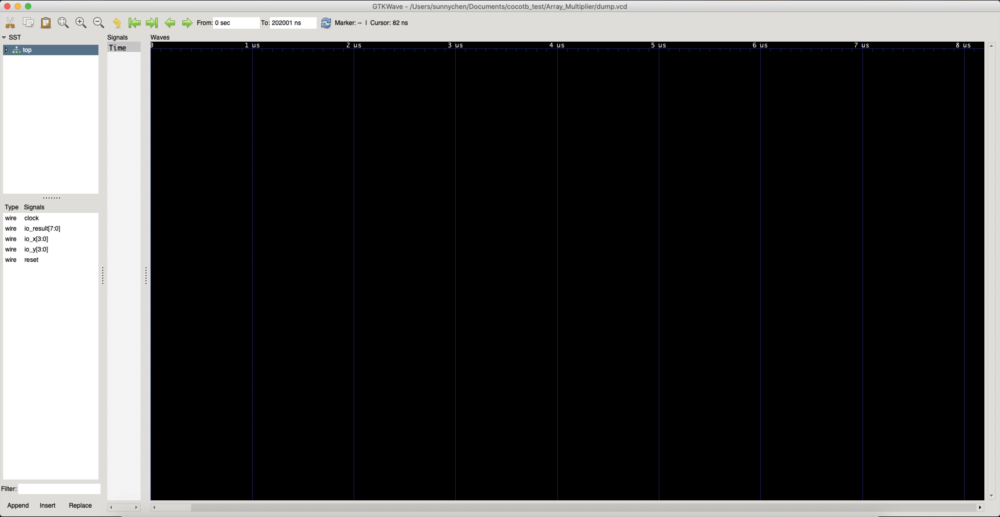
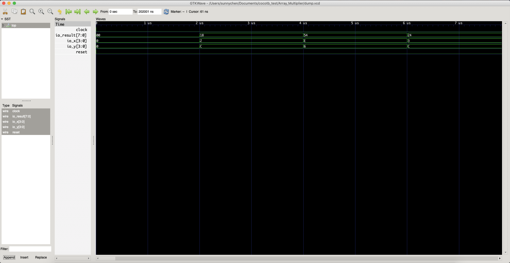

# 实验目的

在计算机组成原理与体系结构这一系列的实验内容当中，将会介绍硬件设计开发相关的基础知识以及对各种硬件设计开发与验证测试的工具以及框架的使用进行熟悉。下面首先概括在这一系列的实验当中需要熟悉学习的相关知识以及设计使用到的工具。

## 硬件开发设计基础

以下是这一系列实验内容所要学习的相关知识：

1. 硬件基础知识简介
2. 组合逻辑电路入门
3. 时序逻辑电路入门
4. 电路实例介绍（运算器、RV32I处理器等）
5. 面向FPGA的算法核设计入门（流水线、数据并行、其他计算技术等）

## 硬件开发设计/验证工具

下面列举这一系列实验内容所需要使用的工具。

针对开发方面的工具有：

1. **PyHCL**；本系列实验主要使用的基于Python的硬件设计开发工具。
2. **Chisel**；由加州大学伯克利分校开发的基于Scala的硬件设计开发工具，作为参考。
3. **FIRRTL**；Flexible Internal Representation for RTL，Chisel的中间层语言，也是PyHCL的目标语言。

用于进行仿真验证测试的工具有：

1. **Cocotb**；基于Python的硬件验证平台。
2. **Verilator**；基于C++的开源仿真工具。
3. **GTKwave**；查看仿真波形文件的工具。
4. **Treadle**；FIRRTL执行器/调试器。
5. **Diagrammer**；FIRRTL代码的图形化工具，可以将FIRRTL代码的逻辑结构以及数据流转化为svg图像进行调试。

# 开发设计/验证工具使用简要说明

在这一节当中会对上述实验所需要的工具安装使用进行简要的说明。

## PyHCL

PyHCL是由笔者团队开发的基于Python的开源硬件开发设计框架，其设计思想与Chisel类似。在数字逻辑课程当中提到过目前工业上主流的硬件设计语言是Verilog和VHDL，然而这个已经有数十年寿命的过程式语言已经无法满足目前越来越庞大越来越复杂的集成电路芯片开发的需求。Chisel是将硬件设计与高层次的程序设计语言相结合的开山鼻祖，其将硬件设计嵌入到高级程序语言Scala当中，提出了硬件敏捷设计的可能性。将硬件设计框架嵌入到基于面向对象的编程语言可以使得硬件设计享受到面向对象语言本体的各种优势。然而，由于Chisel基于的是Scala语言，这种语言使用受众小，学习难度较高，而且社区活跃度也比较低，导致上手的难度高，学习的时间周期长，不利于其推广。因此本团队使用Python语言来设计开发PyHCL，提供一个更为易用、简洁的硬件设计框架。

PyHCL的Github repo：https://github.com/scutdig/PyChip-py-hcl

PyHCL的基础wiki：https://github.com/scutdig/PyChip-py-hcl/wiki

在实验的过程中将会与PyHCL相结合来熟悉这个工具的使用和开发。

### 安装与使用

PyHCL实际上就是使用Python实现的库，因此只要使用Git将PyHCL源码克隆下来后便可以将其放置于项目根目录当中使用，只需要在使用到PyHCL的代码中导入即可：

```python
from pyhcl import *
```

然而，PyHCL需要一定的环境支持，包括：

- Python3.7及以上版本；
- FIRRTL环境，在下文中会对如何配置进行说明；

使用PyHCL来进行开发，操作系统推荐使用Linux的发行版（Ubuntu，Arch系的Manjaro）或者MacOS。

## Chisel

Chisel是较为成熟的工具，最新的版本为Chisel3。在这一系列的实验当中，都会使用PyHCL来进行开发，而Chisel仅仅提供给大家作为参考。Chisel的资料也较为详尽：

Chisel的官网：https://www.chisel-lang.org/

Chisel的Github repo：https://github.com/freechipsproject/chisel3

Chisel的wiki：https://github.com/freechipsproject/chisel3/wiki

Chisel的API文档：https://www.chisel-lang.org/api/latest/

关于Chisel的安装与使用，都可以在Chisel官方的文档中找到，在这里就不再赘述。

## FIRRTL

FIRRTL是Chisel在Chisel3版本引入的框架中间代码层语言，类似于LLVM的存在。在Chisel3版本中，框架工具的编译链条是由Scala到FIRRTL再到Verilog。FIRRTL的引入使得框架的前后端实际上都可以替换为其他的语言。PyHCL的目标语言就是FIRRTL，并调用FIRRTL编译器生成Verilog代码。因此要使用PyHCL需要配置FIRRTL环境。

在FIRRTL的Github repo当中有详细说明FIRRTL的安装配置过程：https://github.com/freechipsproject/firrtl#installation-instructions。

你需要依照上面的说明安装verilator、yosys以及sbt，这是FIRRTL所依赖的环境。接着需要编译安装FIRRTL，如果没有问题，则会在/firrtl/utils/bin当中生成firrtl的可执行文件。接下来你需要将它加入到系统的环境变量当中，针对不同的操作系统，添加环境变量的方法都不一样，这个需要自行上网查阅方法。最终，如果成功将firrtl加入到环境变量当中，在终端中输入`firrtl --help`就可以显示firrtl的命令的相关信息。

## Verilator

Verilator是目前速度最快的开源仿真工具，其原理是将Verilog代码编译成高度并行化的C++代码来执行。它是很多仿真平台（包括Cocotb）以及FIRRTL、Chisel必须的工具之一。Verilator的安装方法可以在官网找到：https://www.veripool.org/projects/verilator/wiki/Installing。

这里简述一下安装的方法：

### 各版本的安装方式

#### Ubuntu

Ubuntu系统的安装方式非常简单，只需要使用apt-get即可：

```Shell
apt-get install verilator
```

#### Manjaro

Manjaro可以使用pacman安装：

```shell
pacman -S verilator
```

#### MacOS

MacOS可以使用brew安装，brew不是内置的，若没安装过则需要安装：

```shell
brew install verilator
```

在终端输入`verilator --version`有版本信息生成说明安装成功。

### 使用Verilator

要使用Verilator，你需要：你所要测试的模块dut的verilog源码、模块测试所需要的harness（C++测试文件，里面会对测试的方式进行说明）。在这里提供一个笔者在Github上公开的例子供大家参考：https://github.com/Groupsun/Verilator_Simple_Usage。

要使用Verilator，需要会书写harness代码，这个C++代码用于指导Verilator如何进行仿真。下面以上述例子中的`Decoder_Sim.cpp`来进行说明。

这个例子需要仿真的模块是一个3-8译码器模块。首先，使用Verilator都需要包含头文件`verilated.h`，如果需要生成波形文件，则需要包含`verilated_vcd_c.h`：

```C++
#include <verilated.h>
#include <verilated_vcd_c.h>
```

harness文件中需要包含编译测试模块得到的头文件，如我们需要测试的模块名称为`Decoder`，那么它编译生成的头文件名称为`VDecoder.h`：

```C++
#include "VDecoder.h"
```

接着需要声明顶层测试模块的指针以及生成波形文件的`VerilatedVcdC`对象指针：

```C++
VDecoder* top;
VerilatedVcdC* tfp;
```

定义仿真时间以及仿真最大时间：

```C++
vluint64_t main_time = 0;		// 仿真时间
const vluint64_t sim_time = 1024;		// 仿真最大时间
```

`main`函数中写测试例程，首先是使用Verilator的一些固定写法，以及启用波形生成选项。同时构造顶层测试模块以及生成波形文件的对象：

```C++
Verilated::commandArgs(argc, argv);
Verilated::traceEverOn(true);
top = new VDecoder;
tfp = new VerilatedVcdC;
top->trace(tfp, 99);
tfp->open("Decoder.vcd");		// 波形文件名字为Decoder.vcd
```

`while`语句中写测试具体实现。首先语句条件就是测试的继续进行的条件：`!Verilated::gotFinish() && main_time < sim_time`。这是比较固定的写法。而语句内则是如何进行测试。在测试的过程中，对dut的输入口进行相关的激励，同时观察输出口的结果就是最基本的测试方法。在这里，IO口的名称就是顶层模块的成员，通过给它们赋值就相当于给予输入口激励：

```C++
top->reset = 0;		// reset输入为0
top->S = count;		// S输入为count的值
count++;
top->eval();			// 时钟步进一个周期
tfp->dump(main_time);		// 结果写入波形文件
main_time++;			// 仿真时间+1
```

在仿真结束后，需要释放动态分配的内存：

```C++
tfp->close();
delete top;
delete tfp;
```

这就是一个最简单的harness测试文件的写法，可以看出，其实这种测试方法有一定的局限性，而且还比较麻烦。在编写完harness文件后，只要在终端执行下列命令就可以完成整个测试过程：

```shell
verilator --cc Decoder.v --exe Decoder_Sim.cpp --trace
make -j -C ./obj_dir -f VDecoder.mk VDecoder
./obj_dir/VDecoder
```

在根目录下，会生成波形文件`Decoder.vcd`，可以使用GTKwave来查看结果。

## GTKwave

GTKwave是一款免费的查看波形文件的工具，如各种仿真工具产生的.vcd文件，它实际上是带有一定格式的文本文件，通过使用GTKwave可以直观的转化为波形图来方便的查看仿真的结果。

### 各版本的安装方式

Windows以及MacOS可以直接在官网上找到下载方式：http://gtkwave.sourceforge.net/

对于Linux的发行版来说，如果是Ubuntu，则使用apt-get即可：

```shell
apt-get install gtkwave
```

如果使用的是Manjaro等Arch系的发行版，则使用pacman即可：

```shell
pacman -S gtkwave
```

### 使用方法

所有的.vcd文件都可以直接使用GTKwave打开。打开后的主界面如下：



左侧显示的是模块的层次以及选中模块中的可以显示波形信息的信号。通过选中对应的信号，并选择"append"就可以将该信号的波形图显示在右侧的波形框图当中：



除此之外，还可以调整波形显示数值的格式、调整时间单位显示（简单的缩小波形即可）等，由于篇幅关系，这里将不再展开，读者可以自行尝试。

## Cocotb

Cocotb是一款基于Python的开源验证平台，它的设计思路类似于使用SystemVerilog搭建的UVM平台。Cocotb的优势是所有的仿真过程对使用者来说都面向Python进行，也就是说所有的仿真例程、harness以及结果回报、呈现都是通过Python层来完成的。Cocotb是一个相对庞大而复杂的平台，在这里只阐述简单的仿真验证使用过程，而其他的高阶使用方式若读者有兴趣可以自行查阅文档使用。

Cocotb的官网：https://cocotb.org/

Cocotb的Github repo：https://github.com/cocotb/cocotb

Cocotb的官方文档：https://cocotb.readthedocs.io/en/latest/index.html

### 各版本的安装方式

Cocotb的安装过程相对比较冗长，在官方文档中给出了各个版本的详细步骤，请读者自行参阅安装即可：https://cocotb.readthedocs.io/en/latest/quickstart.html#quickstart-guide

### 使用方法

要使用Cocotb进行仿真测试，你需要提供：dut的Verilog源码、Python写的测试harness以及一个Makefile文件来指导Cocotb进行make操作完成仿真测试过程。下面以测试一个全加器为例子，说明Cocotb的使用方法 。掌握下面的使用方法就可以进行最简单的仿真测试，如果需要其他更高阶的方式，可以参考官方文档。

#### Python测试harness编写

类似Verilator，Cocotb也需要提供一个类似的harness来指导仿真测试的过程。下面给出完整的例子，再逐一进行说明：

```python
import cocotb
from cocotb.triggers import Timer
from cocotb.result import TestFailure

def full_adder_module(a, b, cin):
    s = a ^ b ^ cin
    cout = (a & b) | (a & cin) | (b & cin)
    return [s, cout]

@cocotb.test()
def fulladder_test(dut):
    yield Timer(2, units='ns')
    a = 0x1
    b = 0x0
    cin = 0x1
    
    dut.io_a = a
    dut.io_b = b
    dut.io_cin = cin

    yield Timer(2, units='ns')

    # Model verification
    s, cout = full_adder_module(a, b, cin)

    if (int(dut.io_s) != s) or (int(dut.io_cout) != cout):
        raise TestFailure(
            "FullAdder result is incorrect: s = %s, cout = %s"%(s, cout))
    else:
        dut._log.info("Ok!")
```

要使用Cocotb，需要导入Cocotb库：

```python
import cocotb
```

指引Cocotb进行仿真测试的函数，需要使用修饰器`@cocotb.test()`。测试的函数需要包含一个参数要表示待测的dut，名字没有强制要求，但默认都使用`dut`。

`yield Timer(value, units)`用于表示仿真过程中的延时，`value`表示延时的长度，而`units`则表示单位。要访问dut中的端口，使用`.`运算符即可。对端口赋值可以使用`=`赋值符号，同时还有一个`<=`的运算符可供使用。官方文档里给出的说明是`<=`是使用`=`的缩写方式，如：

```python
signal <= new_value
signal.value = new_value
```

在实际的测试中，其实这两者似乎没有区别，也就是说，你使用`=`还是`<=`来赋值是没什么区别的（详细可以参见[issue](https://github.com/cocotb/cocotb/issues/526)。

但建议在使用的过程中，最好保持一致性，即要不全部使用`=`，要不全部使用`<=`。

编写一个指导如何进行仿真的函数非常简单，你只需要知道如何给予端口激励（赋值），以及如何延时（保持上次赋值的状态一段时间）就可以了。当然，上述的全加器是一个纯的组合逻辑电路，因此没有考虑到时序的问题。如果需要测试的是时序逻辑电路，那么就需要构造一个时钟，而Cocotb当中提供了非常方便的构造时钟的api：

```python
from cocotb.clock import Clock
def setup_dut(dut):
    cocotb.fork(Clock(dut.clock, CLOCK_PERIOD, units="ns").start())
```

通过`Clock`函数可以构造dut的时钟信号，第一个参数就是dut的时钟端口，第二个参数是一个时钟周期的长度，第三个参数就是单位。最后再在测试函数中调用`setup_dut()`即可。不过需要注意的是，对于一般的时序电路来说，在前几个时钟周期需要置模块的reset端口为高，初始化dut中的寄存器。典型的时序电路的初始设定方式为：

```python
@cocotb.test()
def pc_test(dut):
    dut.reset <= 1
    setup_dut(dut)
    yield Timer(2, units='ns')
    dut.reset <= 0
```

模块可以进行验证，这一点与UVM类似。你可以在测试例程中提供一个参考模型（reference model），表示模块逻辑的正确结果，一般通过一个python函数来实现。如上述的例子，全加器的验证参考模型就是函数`full_adder_module()`。可以将它来和dut仿真的结果进行对比，很方便的判断模块**单纯的结果**是否正确。

#### Makefile编写

Cocotb的Makefile编写很简单，所要提供的必须的参数如下（也是最简单的Makefile）：

```makefile
VERILOG_SOURCES = $(PWD)/PC.v
TOPLEVEL = PC
MODULE = test_pc
SIM = verilator
EXTRA_ARGS += --trace

include $(shell cocotb-config --makefiles)/Makefile.inc
include $(shell cocotb-config --makefiles)/Makefile.sim
```

- `VERILOG_SOURCES`指定测试所需要的Verilog源文件；
- `TOPLEVEL`指定测试的顶层模块；
- `MODULE`指定Python测试harness的文件名；
- `SIM`指定仿真使用的工具（默认使用iverilog，可以使用verilator、modelsim等等，详细支持的仿真工具参考官方文档）
- 如果使用的是verilator，且要生成波形信息，需要在`EXTRA_ARGS`中添加`--trace`参数。
- 最后是使用cocotb必须包含的makefile信息，只需要在每个Makefile末尾添加这两行的include信息即可。

Makefile中还可以指定其他很多的信息，详细可以参考官方文档：https://cocotb.readthedocs.io/en/latest/building.html

编写好python的harness以及Makefile之后，可以直接通过`make`命令来执行cocotb的仿真测试功能。

## Treadle

Treadle是Chisel团队开发的针对FIRRTL的执行器，可以快速进行FIRRTL代码的验证测试。它的好处是可以直接在FIRRTL代码上运行，而不需要下放到Verilog代码进行测试。但它也有显著的缺点，那就是运行效率很低，只适合于进行单元测试。Treadle的安装方式可以在官方的Github repo中找到：https://github.com/freechipsproject/treadle。

官方在主页上的说明只提到了如何将其和Chisel的Tester结合使用，但其实它是一个独立的构建，可以单独使用：https://github.com/freechipsproject/treadle/wiki。

安装配置好Treadle之后，直接在根目录运行脚本`treadle.sh`就可以启动Treadle。通过`load filename`可以读取FIRRTL文件并开始运行。`poke`指令用于给予激励给指定的信号，`peek`指令用于查看当前信号的值。`step`指令用于步进指定的时钟周期。详细的命令列表可以参考：https://github.com/freechipsproject/treadle/wiki/TreadleRepl-commands。

## Diagrammer

Diagrammer是Chisel团队开发的针对FIRRTL代码的可视化工具，可以生成FIRRTL代码模块层次以及模块逻辑的数据流动矢量图形，可以辅助进行调试测试。Diagrammer的官方Github repo：https://github.com/freechipsproject/diagrammer。

只需要clone项目repo，以及安装[GraphViz](https://www.graphviz.org/)依赖就可以使用了。在终端中运行下面的命令就可以在`/project/output`文件夹中得到矢量图形：

```shell
./diagram.sh -i ~/projects/output/circuit.fir
```

# 相关参考资料

下面提供一些相关的参考资料：

1. Hennessy, J. L., & Patterson, D. A. (2011). *Computer architecture: a quantitative approach*. Elsevier. 中译名为《计算机体系结构：量化研究方法》。是计算机体系结构的经典教材，可供一定的参考。

2. Emer, J. S., & Vijayaraghavan, M. Computer Architecture: A Constructive Approach. MIT的计算机体系结构的教材。

3. Patterson, D. A., & Hennessy, J. L. Computer Organization and Design RISC-V Edition: The Hardware Software Interface. 计算机组成和设计：RISC-V版本。将计算机体系结构和RISC-V处理器结合的教材。


