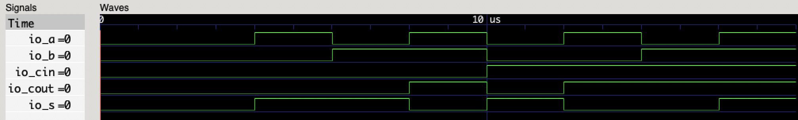
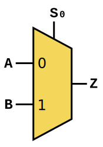
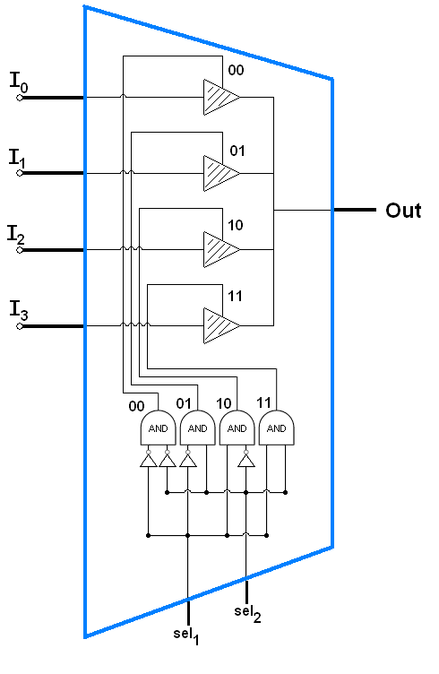
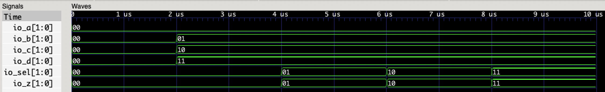
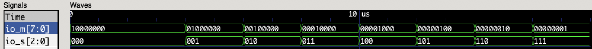
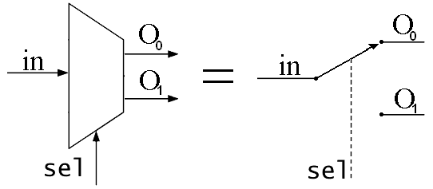

本章主要阐述数字电路设计当中组合逻辑电路的设计。

# 组合逻辑电路理论基础

组合逻辑电路的输出仅由电路的当前输入决定，它不能存储任何信息。也就是说，组合逻辑电路只有逻辑门构成。把组合逻辑电路看作一个只有输入输出可见的黑盒子，那么组合逻辑电路的输出只与当前的输入有关。因此，可以将组合逻辑电路的每个输出$F_i$看作是一个与输入$x_1, x_2, ..., x_n$有关的函数$f$：
$$
F_i=f(x_1, x_2, ..., x_n)
$$
组合逻辑电路可以简单的使用逻辑表达式或者逻辑函数来表示，或者使用真值表、卡诺图的方式来进行表示或者化简。在抽象的电路描述或者仿真当中，一个组合逻辑电路是没有延时的，即输出即时反映输入的变化。但是在实际的电路当中，所有的门电路元件都具有一定的延时。

组合逻辑电路是数字电路当中最为简单的形式，因此首先从组合逻辑电路进行学习熟悉。经典的组合逻辑电路包括有半加器、全加器、数据选择器、数据分配器、编码器、译码器、ALU（算术逻辑单元）等等。

## 分析、设计组合逻辑电路

从已知的逻辑电路图中，可以分析逻辑电路所实现的功能。分析组合逻辑电路的步骤为：

- 根据逻辑图写出逻辑表达式；
- 列出逻辑表达式的真值表；
- 根据真值表分析逻辑功能。

而设计组合逻辑电路，实际上就是分析组合逻辑电路的反向工程：

- 根据对逻辑功能的描述，可以建立逻辑命题，从而确认输入输出的关系，并列出真值表；
- 根据真值表写出逻辑表达式，并进行化简；
- 根据化简后的逻辑表达式，构筑组合逻辑电路。

下面，我们从几个经典的组合逻辑电路的例子来学习组合逻辑电路的设计与分析。

# 半加器与全加器

全加器是加法器当中的一种，加法器是构成CPU当中算术逻辑单元（ALU）的基础。除此之外，加法器也是二进制数的乘法器的重要组成部分之一。加法器有两种基础形式，分别是半加器和全加器。半加器与全加器的区别在于半加器没有金薇输入端，在一些组合硬件的结构当中（比如阵列乘法器），半加器一般作为加法阵列中最低位的部件。

半加器的功能是将两个一位的二进制数相加，产生两个输出：

- **和**：一般记作S；
- **进位输出**：一般记作Cout；

分析半加器的逻辑功能很简单，和输出的是二进制数相加后本位得到的结果，而进位输出则是对下一位的进位输出。很容易就可以列出真值表和逻辑表达式（参见上一章节）。根据逻辑表达式，我们很容易就可以画出它的逻辑符号图：


利用PyHCL来搭建半加器的逻辑电路：

```python
class HalfAdder(Module):
    io = IO(
        x=Input(U.w(1)),
        y=Input(U.w(1)),
        s=Output(U.w(1)),
        cout=Output(U.w(1))
    )

    io.s <<= io.x ^ io.y
    io.cout <<= io.x & io.y
```

在阐述这段代码前，首先要介绍PyHCL类型的基础信息。

## PyHCL类型

在PyHCL当中，所有的电路实体声明的时候都需要声明其类型。电路实体包括输入输出端口、寄存器、Wire类型等等。PyHCL的类型分为两种，基本类型以及组合类型。在这一章节中，首先介绍PyHCL的基本类型有哪些。

### PyHCL基本类型

PyHCL的基本类型有三种，分别是：无符号整数、有符号整数以及布尔类型。实际上，布尔类型是无符号整数的特殊情况，其在PyHCL内核的定义中是1位无符号整数类型。类型声明的方式为：

```python
# 类型的声明实际上就是实例化一个对象。PyHCL规定所有的类型规定必须声明其位宽，因此声明一个电路实体类型的方式是：
# U.w(<width>)	width位的无符号整数类型
# S.w(<width>)	width位的有符号整数类型
# Bool()		布尔类型比较特殊，不需要声明位宽

U.w(4)		# 4位无符号整数
S.w(32)		# 32位有符号整数
Bool()		# 布尔类型
```

对于PyHCL类型的电路实体，赋值也需要使用PyHCL对应类型的字面值，而不能是单纯的Python数值：

```python
# 可以通过Python变量来构造对应的类型的字面值：
# U(<value>)			无符号整数类型字面值（无位宽约束）
# U.w(<width>)(<value>)	无符号整数类型字面值（有位宽约束）
# 有符号整数同理
# 布尔类型只有两种字面值：
# Bool(True)			逻辑真
# Bool(False)			逻辑假

U(16)			# 字面值为16的5位无符号类型字面值，PyHCL会根据字面值的大小自动推断其位宽
S.w(32)(200)	# 字面值为200的32位有符号类型字面值
Bool(True)		# 字面值为真的布尔类型字面值
```

下面来定义几个PyHCL实体来作为例子：

```python
counter = RegInit(U.w(32)(0))		# counter是一个初始值为0的32位无符号数寄存器
addr = Input(U.w(32))				# addr是一个32位无符号数的输入端
jump_flag = Wire(Bool())			# jump_flag是一个布尔类型的Wire
```

回到上述的半加器代码，可以发现定义了4个IO端口，分别是`x`，`y`，`s`以及`cout`。它们的类型都是1位无符号整数。半加器的逻辑定义非常简单，只需要将逻辑表达式照写即可：

```python
io.s <<= io.x ^ io.y		# s = x XOR y
io.cout <<= io.x & io.y		# cout = x AND y
```

`<<=`是PyHCL中重载后的符号，用于表示逻辑电路中的连接。它将右表达式中的信号传输到左表达式当中，要明确的将它和赋值符号`=`相区别。有一个最根本的原则就是，所有电路中的实际连接都需要使用`<<=`符号。在使用PyHCL的过程中一定要将这个区别铭记于心。

一个半加器的实现就是如此的简单。可以通过仿真波形测试结果来查看：


全加器与半加器的区别是，全加器还有一个进位输入的端口，一般记为Cin。在上一章节的实验练习环节中，已经给出了全加器的真值表并要求写出其逻辑表达式，实际上也很简单：
$$
S=A \bigoplus B \bigoplus C_{in}	\\
C_{out}=(A \cdot B)+(A \cdot C_{in})+(B \cdot C_{in})
$$
Cout还可以用另外的形式来表示，逻辑的结果是一样的：
$$
C_{out}=(A \cdot B)+(C_{in} \cdot (A \bigoplus B))
$$
可以得到全加器的电路逻辑图如下：


组合逻辑电路的延时分析可以通过电路逻辑图当中的关键路径来确定。通俗的来说，关键路径就是电路图中从一个输入到输出中经过最多逻辑门的路径。假定一个异或门的延时是3个单位（1个单位表示一个基本逻辑门的延时：与门、或门、非门，这涉及到门电路的CMOS构成，有兴趣的读者可自行查阅资料），可以发现一个全加器的关键路径为经过两个异或门的路径，因此全加器的延迟等于：
$$
T_{FA}=2 \cdot T_{XOR}=2 \cdot 3D=6D
$$
下面给出使用PyHCL实现的全加器代码：

```python
class FullAdder(Module):
    io = IO(
        x=Input(U.w(1)),
        y=Input(U.w(1)),
        cin=Input(U.w(1)),
        s=Output(U.w(1)),
        cout=Output(U.w(1))
    )

    io.s <<= io.x ^ io.y ^ io.cin
    io.cout <<= (io.x & io.y) | (io.x & io.cin) | (io.y & io.cin)
```

实际上，使用全加器和半加器的实现都非常简单，都是直接将逻辑表达式照搬到PyHCL代码中即可。上述代码的仿真结果如下：



# 数据选择器

数据选择器是另一种经典的组合逻辑电路元件，更多的称为多路复用器（Multiplexer）。它的作用是从多个输入信号中选择其中一个信号输出的器件。数据选择器的输出输入可以分为三个部分：

- **控制信号Sel**：n位的控制信号，用于决定选择哪个信号输出；
- **输入信号In**：一般有2^n个输入信号；
- **输出信号Out**：一个输出信号端口。

最简单的数据选择器就是2-1选择器，它从两个端口A、B中选择其中一个端口输出：



在这种情况下，2-1选择器的逻辑表达式如下：
$$
Z=(A \cdot \overline{S})+(B \cdot S)
$$
因此，在具体的电路实现中，实现上述的2-1选择器需要2个与门、1个或门以及1个非门。使用PyHCL来实现上述的选择器，实际上和上述半加器和全加器的方法一致，直接将逻辑表达式照搬即可，具体的实现留作读者自行练习。

如果考虑更为大型的选择器，如4-1选择器，它的逻辑表达式如下：
$$
Z=(A \cdot \overline{S_0} \cdot \overline{S_1})+(B \cdot \overline{S_0} \cdot {S_1})+(C \cdot S_0 \cdot \overline{S_1})+(D \cdot S_0 \cdot S_1)
$$
实际上，可以将上述选择器分为两个部分：1个2-4译码器以及4个三态门实现：



## Mux、LookUpTable模块

数据选择器在数字电路中的使用非常的广泛，如果多次重复实现使用这些数据选择器，会造成不规范性。因此，PyHCL内置有数据选择器模块。`Mux`是PyHCL中内置的最简单的选择器模块，其功能相当于2-1选择器：

```python
# Mux(<选择信号>, <真输出>, <假输出>)
io.z <<= Mux(io.sel, io.b, io.a)
```

上述的`Mux`模块的含义是，当选择信号`io.sel`为真时，输出`io.b`的值。当选择信号为假时，输出`io.a`的值。其中，选择信号必须是布尔类型的电路实体。

更大规模的选择器，可以通过级联2-1选择器来实现，比如，使用3个`Mux`模块来实现一个4-1选择器：

```python
sel_result1 = Mux(io.sel[0], io.b, io.a)	# 运算符[]意为选择信号中的某一位，如此处选择sel的第0位
sel_result2 = Mux(io.sel[0], io.d, io.c)
io.z <<= Mux(io.sel[1], sel_result2, sel_result1)
```

仿真的结果如下，为了显示结果，这里人为将输入的四个端口分别预置了输入的值0～3，分别对应选择信号的值：



可以注意到的是，实际上，输入以及输出端口的位宽是任意的，只要都相等即可。

在某些情况下，选择信号取不同的值可能会有不同的含义，如ALU的选择信号，可能对应不同的算术逻辑运算。这时候就需要使用`LookUpTable`模块。`LookUpTable`模块是`Mux`模块的进阶版本，其形式类似于查找表，但它在PyHCL内核的实现仍然是基于`Mux`的：

```python
# 使用LookUpTable实现的4-1选择器
io.z <<= LookUpTable(io.sel, {
  U(0): io.a,
  U(1): io.b,
  U(2): io.c,
  U(3): io.d,
  ...: U(0)
})
```

`LookUpTable`接受两个参数，第一个参数是选择信号，它可以是任意基本类型，但是它必须和第二个参数中的map当中的键值类型相同。第二个参数是一个python的map数据结构，可以在其中给出当选择信号取不同的值时，所输出的信号。比如，当选择信号的值为1时，`LookUpTable`输出`io.b`。`LookUpTable`可以很灵活的进行使用，但是其效率可能会稍劣于直接使用`Mux`模块进行级联，但其可读性要强很多。FIRRTL编译器会进行一定的优化，所以在觉得使用`LookUpTable`更方便的时候，可以大胆的使用它。

# 译码器

译码器在组合逻辑电路中的使用也非常的广泛，其作用是将一个二进制数字转化为特定的对象。例如，一个典型的3-8译码器，将3位的二进制数值转化为对应数值的第n个输出置高。举例来说，当输入为011时，数值为3，则第4个输出口置高（第1个输出口表示数值0），其真值表可以表示为：

|  s2  |  s1  |  s0  |  m0  |  m1  |  m2  |  m3  |  m4  |  m5  |  m6  |  m7  |
| :--: | :--: | :--: | :--: | :--: | :--: | :--: | :--: | :--: | :--: | :--: |
|  0   |  0   |  0   |  1   |  0   |  0   |  0   |  0   |  0   |  0   |  0   |
|  0   |  0   |  1   |  0   |  1   |  0   |  0   |  0   |  0   |  0   |  0   |
|  0   |  1   |  0   |  0   |  0   |  1   |  0   |  0   |  0   |  0   |  0   |
|  0   |  1   |  1   |  0   |  0   |  0   |  1   |  0   |  0   |  0   |  0   |
|  1   |  0   |  0   |  0   |  0   |  0   |  0   |  1   |  0   |  0   |  0   |
|  1   |  0   |  1   |  0   |  0   |  0   |  0   |  0   |  1   |  0   |  0   |
|  1   |  1   |  0   |  0   |  0   |  0   |  0   |  0   |  0   |  1   |  0   |
|  1   |  1   |  1   |  0   |  0   |  0   |  0   |  0   |  0   |  0   |  1   |

在真实的74系列译码器中，会有使能等的接口，在这里忽略。在这个译码器中，使用PyHCL实现第一时间所想到的是使用`LookUpTable`实现，这是一种方法：

```python
io.m <<= LookUpTable(io.s, {
  U(0): U(0x80),
  U(1): U(0x40),
  U(2): U(0x20),
  U(3): U(0x10),
  U(4): U(0x08),
  U(5): U(0x04),
  U(6): U(0x02),
  U(7): U(0x01),
  ...: U(0)
})
```

实际上，你还可以使用右移运算符：

```python
io.m <<= U(0x80) >> io.s
```

3-8译码器的仿真结果如下：



# 实验内容与练习

## 4位加法器

4位加法器可以通过3个1位的全加器以及1个半加器（使用4个全加器亦可，只需要将最低位的全加器进位输入置0即可）级联得到。上述已经提供了1位全加器的实例代码，请使用PyHCL来通过级联4个全加器的方式来实现一个4位加法器，并自行仿真验证其正确性。

## 2-1选择器与4-1选择器

使用PyHCL来实现上述的2-1选择器与4-1选择器，并自行仿真验证其正确性。

## 数据分配器

数据分配器是与数据选择器相反的功能器件，它将一个输入分配到2^n个输出当中，分配信号为n。如一个1-2的数据分配器如下：



请使用PyHCL实现一个1-4数据分配器，并自行仿真验证其正确性。

## 编码器

编码器是与译码器相反的功能器件，它将输入编码为二进制数值输出。一个3位优先级的编码器真值表如下：

|  s7  |  s6  |  s5  |  s4  |  s3  |  s2  |  s1  |  s0  |  m2  |  m1  |  m0  |
| :--: | :--: | :--: | :--: | :--: | :--: | :--: | :--: | :--: | :--: | :--: |
|  1   |  x   |  x   |  x   |  x   |  x   |  x   |  x   |  1   |  1   |  1   |
|  0   |  1   |  x   |  x   |  x   |  x   |  x   |  x   |  1   |  1   |  0   |
|  0   |  0   |  1   |  x   |  x   |  x   |  x   |  x   |  1   |  0   |  1   |
|  0   |  0   |  0   |  1   |  x   |  x   |  x   |  x   |  1   |  0   |  0   |
|  0   |  0   |  0   |  0   |  1   |  x   |  x   |  x   |  0   |  1   |  1   |
|  0   |  0   |  0   |  0   |  0   |  1   |  x   |  x   |  0   |  1   |  0   |
|  0   |  0   |  0   |  0   |  0   |  0   |  1   |  x   |  0   |  0   |  1   |
|  0   |  0   |  0   |  0   |  0   |  0   |  0   |  1   |  0   |  0   |  0   |

优先级编码器规定，输入端位数越高优先级越高。如当输入的第6位为1，第7位为0时，无论第0～5位值为多少，其输出的编码值都是110（即数值6）。请使用PyHCL来实现上述的3位优先级编码器，并自行仿真验证其正确性。

## 简易ALU

算术逻辑单元（ALU）是CPU当中的核心运算部件。假设一个简易的ALU，它只支持4种运算，分别是加、减、乘以及除。ALU有以下的IO端口：

- 两个数据输入端口`src_a`以及`src_b`，类型为32位无符号整数。
- 一个2位的控制信号`aluop`，用于选择所要进行的算术运算。
- 一个结果输出端口`result`，类型为32位无符号整数。

规定，控制信号为0时，进行加法运算。控制信号为1时，进行减法运算。控制信号为2时，进行乘法运算。控制信号为3时，进行除法运算。规定a作为被操作的运算数（左操作数），b为右操作数。请用PyHCL实现上述的简易ALU，并自行仿真验证其正确性。

# 思考

## Map与LookUpTable

上述的LookUpTable的使用，可以发现都是手工构造Map来实现的。然而，很多时候查找表具有一定的规律性，可以使用特定的方式来进行构造，也就是说，可以通过一个python函数的方式来构造一个Map。不妨可以尝试使用一个函数来构造一个选择器或者译码器的Map结构。

## `=`与`<<=`

在4-1级联实现的代码中，是一个区分`=`与`<<=`实现的典型例子。在PyHCL内核中，综合电路的关键是扫描所有的`<<=`连接符来构造一棵语法树。这里提出的一个问题是，如果我把`sel_result1`以及`sel_result2`对应的运算符换为`<<=`，代码需要作出怎样的修改？

## 仲裁

仲裁是一种重要的组合逻辑结构，它将输入（一般来自于一个FIFO的数据结构）进行仲裁，决定哪个输出口能够获得该数据，如下图：


思考如何实现上述的仲裁结构，假设三个端口都有如下的信号：

- 数据端口，类型为32位无符号整数；
- ready端口，布尔类型；
- valid端口，布尔类型。

`valid`端口用于告知外部设备数据是否有效，它需要考虑`ready`端口是否为高，以及优先级性。这里规定PE0的优先级比PE1更高。下面给出Arbiter的输入输出端口声明，思考如何实现其逻辑：

```python
class Arbiter(Module):
  io = IO(
    // FIFO
    fifo_valid=Input(Bool())
    fifo_ready=Output(Bool())
    fifo_data=Input(U.w(32))
    
    // PE0
    pe0_valid=Output(Bool())
    pe0_ready=Input(Bool())
    pe0_data=Output(U.w(32))
    
    // PE1
    pe1_valid=Output(Bool())
    pe1_ready=Input(Bool())
    pe1_data=Output(U.w(32))
  )
  
  # ???
```
