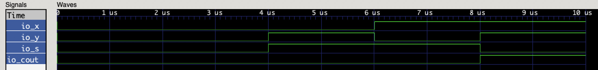

本章主要阐述数字电路设计当中组合逻辑电路的设计。

# 组合逻辑电路理论基础

组合逻辑电路的输出仅由电路的当前输入决定，它不能存储任何信息。也就是说，组合逻辑电路只有逻辑门构成。把组合逻辑电路看作一个只有输入输出可见的黑盒子，那么组合逻辑电路的输出只与当前的输入有关。因此，可以将组合逻辑电路的每个输出$F_i$看作是一个与输入$x_1, x_2, ..., x_n$有关的函数$f$：
$$
F_i=f(x_1, x_2, ..., x_n)
$$
组合逻辑电路可以简单的使用逻辑表达式或者逻辑函数来表示，或者使用真值表、卡诺图的方式来进行表示或者化简。在抽象的电路描述或者仿真当中，一个组合逻辑电路是没有延时的，即输出即时反映输入的变化。但是在实际的电路当中，所有的门电路元件都具有一定的延时。

组合逻辑电路是数字电路当中最为简单的形式，因此首先从组合逻辑电路进行学习熟悉。经典的组合逻辑电路包括有半加器、全加器、数据选择器、数据分配器、编码器、译码器、ALU（算术逻辑单元）等等。

## 分析、设计组合逻辑电路

从已知的逻辑电路图中，可以分析逻辑电路所实现的功能。分析组合逻辑电路的步骤为：

- 根据逻辑图写出逻辑表达式；
- 列出逻辑表达式的真值表；
- 根据真值表分析逻辑功能。

而设计组合逻辑电路，实际上就是分析组合逻辑电路的反向工程：

- 根据对逻辑功能的描述，可以建立逻辑命题，从而确认输入输出的关系，并列出真值表；
- 根据真值表写出逻辑表达式，并进行化简；
- 根据化简后的逻辑表达式，构筑组合逻辑电路。

下面，我们从几个经典的组合逻辑电路的例子来学习组合逻辑电路的设计与分析。

# 半加器与全加器

全加器是加法器当中的一种，加法器是构成CPU当中算术逻辑单元（ALU）的基础。除此之外，加法器也是二进制数的乘法器的重要组成部分之一。加法器有两种基础形式，分别是半加器和全加器。半加器与全加器的区别在于半加器没有金薇输入端，在一些组合硬件的结构当中（比如阵列乘法器），半加器一般作为加法阵列中最低位的部件。

半加器的功能是将两个一位的二进制数相加，产生两个输出：

- 和：一般记作S；
- 进位输出：一般记作Cout；

分析半加器的逻辑功能很简单，和输出的是二进制数相加后本位得到的结果，而进位输出则是对下一位的进位输出。很容易就可以列出真值表和逻辑表达式（参见上一章节）。根据逻辑表达式，我们很容易就可以画出它的逻辑符号图：


利用PyHCL来搭建半加器的逻辑电路：

```python
class HalfAdder(Module):
    io = IO(
        x=Input(U.w(1)),
        y=Input(U.w(1)),
        s=Output(U.w(1)),
        cout=Output(U.w(1))
    )

    io.s <<= io.x ^ io.y
    io.cout <<= io.x & io.y
```

在阐述这段代码前，首先要介绍PyHCL类型的基础信息。

## PyHCL类型

在PyHCL当中，所有的电路实体声明的时候都需要声明其类型。电路实体包括输入输出端口、寄存器、Wire类型等等。PyHCL的类型分为两种，基本类型以及组合类型。在这一章节中，首先介绍PyHCL的基本类型有哪些。

### PyHCL基本类型

PyHCL的基本类型有三种，分别是：无符号整数、有符号整数以及布尔类型。实际上，布尔类型是无符号整数的特殊情况，其在PyHCL内核的定义中是1位无符号整数类型。类型声明的方式为：

```python
# 类型的声明实际上就是实例化一个对象。PyHCL规定所有的类型规定必须声明其位宽，因此声明一个电路实体类型的方式是：
# U.w(<width>)	width位的无符号整数类型
# S.w(<width>)	width位的有符号整数类型
# Bool()				布尔类型比较特殊，不需要声明位宽

U.w(4)		# 4位无符号整数
S.w(32)		# 32位有符号整数
Bool()		# 布尔类型
```

对于PyHCL类型的电路实体，赋值也需要使用PyHCL对应类型的字面值，而不能是单纯的Python数值：

```python
# 可以通过Python变量来构造对应的类型的字面值：
# U(<value>)						无符号整数类型字面值（无位宽约束）
# U.w(<width>)(<value>)	无符号整数类型字面值（有位宽约束）
# 有符号整数同理
# 布尔类型只有两种字面值：
# Bool(True)						逻辑真
# Bool(False)						逻辑假

U(16)					# 字面值为16的5位无符号类型字面值，PyHCL会根据字面值的大小自动推断其位宽
S.w(32)(200)	# 字面值为200的32位有符号类型字面值
Bool(True)		# 字面值为真的布尔类型字面值
```

下面来定义几个PyHCL实体来作为例子：

```python
counter = RegInit(U.w(32)(0))		# counter是一个初始值为0的32位无符号数寄存器
addr = Input(U.w(32))						# addr是一个32位无符号数的输入端
jump_flag = Wire(Bool())				# jump_flag是一个布尔类型的Wire
```

回到上述的半加器代码，可以发现定义了4个IO端口，分别是`x`，`y`，`s`以及`cout`。它们的类型都是1位无符号整数。半加器的逻辑定义非常简单，只需要将逻辑表达式照写即可：

```python
io.s <<= io.x ^ io.y			# s = x XOR y
io.cout <<= io.x & io.y		# cout = x AND y
```

`<<=`是PyHCL中重载后的符号，用于表示逻辑电路中的连接。它将右表达式中的信号传输到左表达式当中，要明确的将它和赋值符号`=`相区别。有一个最根本的原则就是，所有电路中的实际连接都需要使用`<<=`符号。在使用PyHCL的过程中一定要将这个区别铭记于心。

一个半加器的实现就是如此的简单。可以通过仿真波形测试结果来查看：



全加器与半加器的区别是，全加器还有一个进位输入的端口，一般记为Cin。在上一章节的实验练习环节中，已经给出了全加器的真值表并要求写出其逻辑表达式，实际上也很简单：
$$
S=A \bigoplus B \bigoplus C_{in}	\\
C_{out}=(A \cdot B)+(A \cdot C_{in})+(B \cdot C_{in})
$$
Cout还可以用另外的形式来表示，逻辑的结果是一样的：
$$
C_{out}=(A \cdot B)+(C_{in} \cdot (A \bigoplus B))
$$
可以得到全加器的电路逻辑图如下：


组合逻辑电路的延时分析可以通过电路逻辑图当中的关键路径来确定。通俗的来说，关键路径就是电路图中从一个输入到输出中经过最多逻辑门的路径。假定一个异或门的延时是3个单位（1个单位表示一个基本逻辑门的延时：与门、或门、非门，这涉及到门电路的CMOS构成，有兴趣的读者可自行查阅资料），可以发现一个全加器的关键路径为经过两个异或门的路径，因此全加器的延迟等于：
$$
T_{FA}=2 \cdot T_{XOR}=2 \cdot 3D=6D
$$
下面给出使用PyHCL实现的全加器代码：

```python
class FullAdder(Module):
    io = IO(
        x=Input(U.w(1)),
        y=Input(U.w(1)),
        cin=Input(U.w(1)),
        s=Output(U.w(1)),
        cout=Output(U.w(1))
    )

    io.s <<= io.x ^ io.y ^ io.cin
    io.cout <<= (io.x & io.y) | (io.x & io.cin) | (io.y & io.cin)
```


