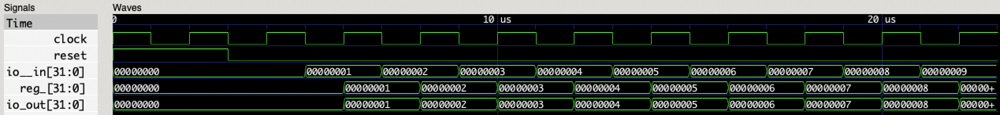
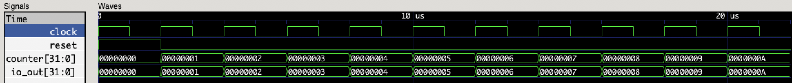
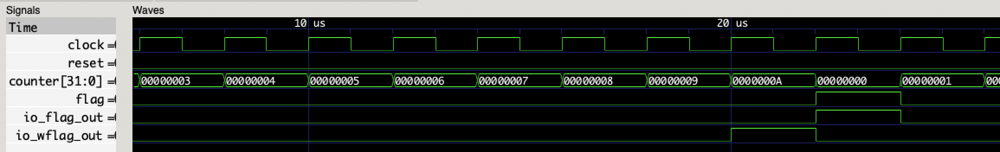
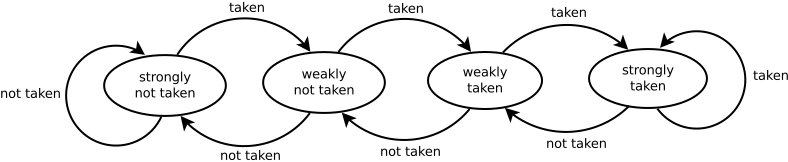

本章主要阐述数字电路中设计中时序逻辑电路的设计。

# 时序逻辑电路理论基础

组合逻辑电路的稳态输出只与当前的输入有关。而时序逻辑电路的稳态输出不仅取决于当前的输入，还与前一刻输入形成的状态有关。也就是说，时序逻辑电路具有储存元件来存储信息，而组合逻辑电路则没有。时序逻辑电路可以构筑为有限状态机或者是某些形式的电脑内存。绝大部分现实中的数字集成电路，都是时序逻辑电路以及组合逻辑电路的组合。

描述时序逻辑电路不能仅由输入的状态来决定，因此对时序逻辑电路功能表述需要使用多个方程组：

**输出方程组**。描述输出与当前输入以及电路逻辑状态的关系，其中输入规定为$y_j$ ，输入规定为$x_i$，电路逻辑状态为$q_k$：
$$
y_j=f_j(x_1, x_2, ..., x_i, q_1, q_2, ..., q_k)
$$
**驱动/激励方程组**。描述当前输入以及电路逻辑状态产生的驱动信号：
$$
z_j=g_j(x_1, x_2, ..., x_i, q_1, q_2, ..., q_k)
$$
**状态/次态方程组**。描述下一时刻的电路逻辑状态与当前驱动信号以及电路逻辑状态的关系：
$$
q_{k_{n+1}}=h_k=(z_1, z_2, ..., z_k, q_{1_{n}}, q_{2_{n}}, ..., q_{k_{n}})
$$

## 同步时序逻辑电路

如今几乎所有的时序逻辑电路都是同步时序逻辑电路。在同步时序逻辑电路当中，所有存储元件都在时钟脉冲的统一控制下。对于所有存储元件来说（触发器、寄存器、内存单元），其存储的内部状态都只会在时钟的**边沿**（可以是上升沿，也可以是下降沿）改变。因此，同步时钟电路最大的优点是实现简单，在两个寄存器之间的组合逻辑电路的运算，必须在时钟的两个边沿间隔内完成（通常称为一个时钟周期）。

# 寄存器

寄存器是时序逻辑电路中的基本部件，学习时序逻辑电路，就要从学习寄存器的性质开始。寄存器一般由D触发器构成，寄存器的特点是，在每个时钟边沿（一般是上升沿，在后文当中，默认所有的边沿都指上升沿）会将当前储存的逻辑状态改变为输入的逻辑状态。也就是说，在每个时钟的上升沿，输入端的数据会写入到寄存器当中。

在PyHCL当中，定义寄存器有两种方式，分别是`Reg()`以及`RegInit()`。两者的区别是后者在`reset`信号置高的时候会将寄存器的值设为初始值。定义寄存器的例子如下：

```python
counter = Reg(U.w(32))	# 定义一个存储32位无符号整数的寄存器counter
value = RegInit(S.w(16)(0))	# 定义一个存储16位有符号整数的寄存器value，且初始值为0
```

不妨使用一个最简单的寄存器的模块例子，以及其生成的Verilog代码以及仿真波形来观察寄存器的行为：

```python
class Register(Module):
    io = IO(
        _in=Input(U.w(32)),
        out=Output(U.w(32))
    )

    reg = Reg(U.w(32))
    reg <<= io._in
    io.out <<= reg
```

所生成的Verilog代码（忽略了一些对实际逻辑不会产生影响的代码）：

```verilog
module Register(
  input         clock,
  input         reset,
  input  [31:0] io__in,
  output [31:0] io_out
);
  reg [31:0] reg_;
  assign io_out = reg_;
  always @(posedge clock) begin
    reg_ <= io__in;
  end
endmodule
```

可以发现，寄存器`reg_`在每个时钟上升沿，都会写入输入口`io__in`的值，而输出口`io_out`则会输出寄存器当前的值。下面再来看看仿真的结果：



在仿真设定中，输入口的数据在时钟的下降沿变化，并持续一个时钟周期。可以发现，寄存器的状态只会在时钟上升沿时发生变化，写入当前输入端口的值。

从上面PyHCL以及Verilog的代码当中，我们还可以发现一个区别，那就是在PyHCL代码中，**具体的时序信息会被隐藏起来**。因此，在使用PyHCL进行电路建模的时候，需要对寄存器的操作有一个时序的模型在脑海当中。也就是说，**所有写入到寄存器相关的操作，都是依赖于时钟信息的**。下面看另一个例子：

```python
class Register(Module):
    io = IO(
        out=Output(U.w(32))
    )

    counter = RegInit(U.w(32)(0))
    counter <<= counter + U(1)
    io.out <<= counter
```

这个例子当中，寄存器`counter`会不断的自增。上面说过，所有写入寄存器的操作都和时钟相关。因此，这个自增的操作反映到实际的电路时序模型当中，就是在每个时钟周期的上升沿自增：



在上面的例子当中，我们使用了`RegInit()`来构造寄存器。在使用了这种寄存器的电路当中，需要注意在仿真开始前必须要把`reset`信号置高，否则寄存器可能会发生初始化问题。置高`reset`信号（一般1～2个时钟周期即可）后寄存器就能设置为代码中规定的初始值0。

## 控制逻辑

PyHCL提供了一组控制逻辑原语来帮助使用者方便的书写类似高级编程语言当中的条件判断语句，其实现的原理实际上就是`Mux`原语嵌套。在时序逻辑电路当中，对控制逻辑的使用会非常多。PyHCL中实现的控制逻辑原语有三个，分别为：`when()`，`elsewhen()`以及`otherwise()`。分别对应`if`，`elif`以及`else`逻辑关系。在PyHCL中实现为对象的`__enter__()`以及`__exit__()`方法。因此，在使用上述三个逻辑控制原语的时候需要使用`with`关键字：

```python
with when(counter >= U(10)):
  io.flag <<= Bool(True)
  io.eflag <<= Bool(False)
  counter <<= U(0)
with elsewhen((counter >= 5) & (counter < 10)):
  io.flag <<= Bool(False)
  io.eflag <<= Bool(True)
  counter <<= counter + U(1)
with otherwise():
  counter <<= counter + U(1)
```

需要注意的是，在PyHCL当中，如果需要将逻辑判断组合来写，需要在**所有**内嵌的逻辑运算中加上括号，且与运算的优先级无关。如上面例程中的`(counter >= 5) & (counter < 10)`。下面举一个实例来说明控制逻辑的运用以及进一步探讨寄存器的性质：

```python
class Register(Module):
    io = IO(
        flag_out=Output(Bool),
        wflag_out=Output(Bool)
    )

    counter = RegInit(U.w(32)(0))
    flag = RegInit(Bool(False))
    io.flag_out <<= flag
    with when(counter > U(9)):
        flag <<= Bool(True)
        counter <<= U(0)
        io.wflag_out <<= Bool(True)
    with otherwise():
        counter <<= counter + U(1)
        io.wflag_out <<= Bool(False)
        flag <<= Bool(False)
```

上述模块逻辑实现的意义是，寄存器`counter`作为一个计数器，当计数超过10时上溢置零，并将寄存器`flag`置为真。模块有两个输出，它们赋值的方式有所不同：`flag_out`输出的是寄存器`flag`的值，而`wflag_out`输出的则是直接的逻辑字面值。这个例子的仿真结果为：



可以发现，寄存器的写入会延后一个时钟周期。实际上，结合寄存器的性质可以很容易解释这一点，当寄存器的数值到达最大值之后，此时逻辑规定写入寄存器的值变为高，但是写入寄存器必须发生在时钟的上升沿，可以理解为比较寄存器值和最大值发生在20~22us之间的时钟周期的组合逻辑当中，因此写入到寄存器必须发生在后一个周期。但是`wflag_out`的输出是纯组合逻辑电路，它可以即时反应逻辑结果，因此它在`counter`为10的周期立即置高。

这个例子反应的看似是一个很简单的问题，但是在实际的电路开发当中，必须时刻注意寄存器这种写的滞后性，否则开发的电路时序可能会产生诸多问题。

# 实验内容与练习

在时序逻辑电路中，实际上只需要掌握了寄存器的使用，就可以设计与实现时序逻辑电路了。在这一章节当中，将会与实验相结合来进行说明与学习。

## 移位寄存器

使用上述的寄存器相关知识，构建一个如下的移位寄存器模块：

- 模块的输出是一个4位的无符号整数端口；
- 模块的输入是一个1位的无符号整数端口；
- 模块当中含有四个1位的无符号整数寄存器；
- 每个时钟周期，输入的信号移动到下一个寄存器当中；
- 模块的输出就是四个寄存器信号输出的组合。

设四个寄存器分别为R0、R1、R2以及R3，分别表示输出端口的第0、1、2以及3位。也就是说，每个时钟周期，输入信号的流动方向为：输入到R0、R0到R1、R2到R3，R3原数据会被覆盖。

### CatBits

在PyHCL当中，提供了一个API接口来对若干个电路实体中的信号进行组合。这个接口是`CatBits`。`CatBits`接受的参数可以是一个参数的列表，或者是一个`List`类型的变量，这其中存储有需要被组合的信号。例如：

```python
io.output <<= CatBits(r3, r2, r1, r0)		# 组合寄存器r0、r1、r2以及r3中的信号
```

需要注意的是，参数列表中的顺序决定了输出的最高位以及最低位。参数列表的排列按照从最高位到最低位的顺序来排列，如上面的例子中，`r3`的信号将会作为输出的最高位，而`r0`则为最低位。

因此，利用上述的寄存器的相关知识以及`CatBits`接口，实现上述的移位寄存器：

```python
class ShiftRegister(Module):
  io = IO(
  	sin=Input(U.w(1)),
    output=Output(U.w(4))
  )
  
  # 实现逻辑
```

### 另一种方式

如果不使用`CatBits`，而在模块内部直接使用一个4位的无符号整数寄存器，是否可以实现上述移位寄存器的功能呢？该寄存器的信号将直接输出到`output`端口当中：

```python
io.output <<= shiftregister
```

## 有限状态机

有限状态机（Finite-State Machine，FSM）是用来表示有限个状态之间的转移和动作等行为的数学计算模型。时序逻辑电路实际上就是一种有限状态机，FSM的下一个状态和输出就是由输入和当前的状态所决定。因此，状态机在时序电路中有很广泛的应用。下面举一个实例来进行说明。

在处理器当中，具有一个分支预测器的部件，该部件的主要功能是用于预测分支指令执行结束时哪一路分支会被执行，以提高处理器流水线的性能。所谓的分支指令，特指条件分支指令，也就是需要根据一定的条件来决定是否执行分支的指令。比如下列的RISC-V汇编指令：

```assembly
beq x1, x2, 0x12
```

它表示若寄存器x1以及x2的值相同时，则跳转到地址为0x24的指令处执行，否则将继续顺序执行下去。如果没有分支预测器，那么流水线处理器就需要在分支指令执行至少到“执行”流水线阶段时才能够得到分支的执行路径，否则在此之前只能冒泡等待。

分支预测器所使用的预测策略会影响到性能，而比较简单的预测策略包括饱和计数器。而饱和计数器就是基于状态机来实现，其实现包括一个2位的具有4个状态的状态机：



饱和计数器有四个状态，分别为：

- 强不选择（Strongly not taken）；
- 弱不选择（Weakly not taken）；
- 弱选择（Weakly taken）；
- 强选择（Strongly taken）。

分支预测器根据当前的状态进行预测，并根据真实的结果改变状态。例如，当前饱和计数器的状态是弱不选择，那么当前的分支指令将会预测其不会进行分支，按顺序执行。如果在执行阶段得到的结果是分支指令会进行分支执行，那么就会将状态转移到弱选择。

考虑实现一个简单的饱和计数器：

- 饱和计数器是一个2位的计数器，也就是一个2位的无符号整数寄存器；
- 一个输入的端口，表示分支是否执行（taken or not taken）；
- 一个输出的端口，输出饱和计数器当前的状态。

实现的模版如下：

```python
class SaturatingCounter(Module):
  io = IO(
  	taken=Input(Bool),
    status=Output(U.w(2))
  )
  
  # 实现逻辑
```

## FIFO初探

使用硬件来实现一个先入先出的数据结构（队列）。在软件上实现一个队列的数据结构非常简单，但是在硬件上，如何来实现一个FIFO的数据结构？考虑实现一个3单元的FIFO硬件数据结构：

- 模块当中的FIFO核心数据结构由3个32位的无符号整数寄存器构成；
- 输入端口`en`，布尔类型，当`en`置高时才会插入数据到队列当中；
- 输入端口`value`，32位无符号整数，数据输入端口；
- 输入端口`out_en`，布尔类型，当`out_en`置高时才会将队列中的队列头弹出到数据输出端口；
- 输出端口`out`，32位无符号整数，数据输出端口，若`out_en`为低，则输出为0，否则输出队列头数据；

实现的模版如下：

```python
class FIFO(Module):
  io = IO(
  	en=Input(Bool),
    value=Input(U.w(32)),
    out_en=Input(Bool),
    out=Output(U.w(32))
  )
  
  # 实现逻辑
```

HINT：使用移位寄存器。

### 思考

如果这个FIFO数据结构中每个成员还有生存时间，也就是说在一定时钟周期后其无论是否被弹出都将会被删除，那么这个FIFO如何实现？假设进入FIFO中的每个数据成员的生存时间为4个时钟周期。


