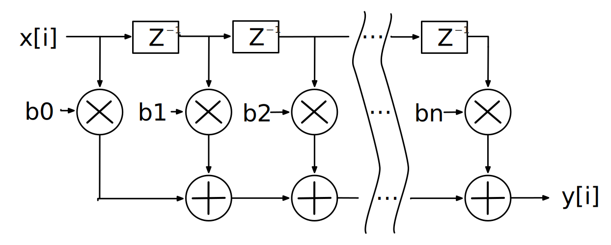

在这一章节当中，将会结合一些具体的应用实例来说明组合逻辑电路以及时序逻辑电路的设计，并介绍一些PyHCL的高阶使用方法。在这一章节当中，所有的实例都不会给出具体的硬件代码实现，而是仅讲述其原理以及结构，最终的代码实现以及仿真均由读者完成。

# 阵列乘法器

在处理器当中，实现乘法的方式有很多种。如果指令集自身不具有乘法指令，且硬件自身没有乘法器，那么可以通过加法指令以及移位寄存器来实现类似于手算二进制乘法原理的乘法指令。但是这种方法的效率非常低下，因此考虑使用硬件来实现一个乘法运算单元。下面介绍一种简单的4x4阵列乘法器的结构。

首先考虑手工计算二进制数乘法的步骤，下面给出一个例子：


可以发现，计算过程中，首先让被乘数与乘数各个位进行按位与操作，得到部分积。部分积之间再做加法操作得到乘法的结果。实际上，计算的过程可以使用一定的与门以及加法器实现：


4位二进制数乘法得到的结果最大可以有8位。请根据上述的硬件电路结构图，使用PyHCL实现上述的简单4x4的阵列乘法器，并进行仿真验证操作。

## 华莱士乘法器

上述的阵列乘法器虽然直观简单，但是其有一个明显的缺点，就是当乘法数位数增长后，进位链会变得非常长，从而导致延时较大，效率降低。而华莱士乘法器通过逐层减少各权重的与结果来降低传统阵列乘法器的进位延时。下面来看一个具体的运算例子。

考虑两个二进制数的相乘：1011 * 1101（11 * 13）。其运算步骤如下：

```
        1 0 1 1
      x 1 1 0 1
----------------
        1 0 1 1
      0 0 0 0
    1 0 1 1
  1 0 1 1
----------------
1 0 0 0 1 1 1 1
```

下面对部分积进行变形，根据部分积中每一位的权重来进行排列，如权重为1的是x0和y0的乘积，权重为2的是x1和y0以及x0和y1的乘积。权重的排列从右至左越来越大，也就是说，将权重排列如下：

| 权重64 | 权重32 | 权重16 | 权重8 | 权重4 | 权重2 | 权重1 |
| :----: | :----: | :----: | :---: | :---: | :---: | :---: |
|  x3y3  |  x3y2  |  x3y1  | x3y0  | x2y0  | x1y0  | X0y0  |
|        |  x2y3  |  x2y2  | x2y1  | x1y1  | x0y1  |       |
|        |        |  x1y3  | x1y2  | x0y2  |       |       |
|        |        |        | x0y3  |       |       |       |

因此，上述的运算步骤中的部分积排列更改为：

```
        1 0 1 1
      x 1 1 0 1
----------------
  1 1 0 1 0 1 1
    0 0 0 0 0
      1 1 1
        1
```

首先使用两个半加器计算x0y3与x1y2以及x1y3与x2y2的结果得到：

```
  1 1 0 1 0 1 1
    0 1 0 0 0
    0 1 0 1   
```

接着对权重4到权重32进行全加以及半加操作：

```
  1 1 0 1 0 1 1
  0 1 0 0 1 0   
```

输入到最后一层加法器得到：

```
1 0 0 0 1 1 1 1
```

实际上，华莱士树利用的原理是：一个全加器中的三个输入口虽然有赋予意义：两个输入数以及一个进位输入，但是实际上，交换任意两个输入得到的结果实际上是一样的。同时，三个输入得到两个输出，意味着运算数减少。回到上面的计算步骤，可以发现除了最后一步以外，部分积的结果之间不会产生进位链，因此可以有效的降低延迟，然而布线的复杂度会提高：


请根据上述的华莱士乘法器原理以及结构图，使用PyHCL实现一个4x4的华莱士乘法器，并自行仿真验证其正确性。

> 把一串全加器简单排成一行，它们之间进位线不连,，把这样一串全加器称为保留进位加法器（CSA）。CSA具有以下的特性：三个输入数等于两个输出数之和（注意进位属于下一位），因此CSA可以将3个输入数缩减为2个数。

# FIR滤波器

有限脉冲响应（FIR）滤波器在DSP领域的使用非常广泛，并且其非常适合于使用FIFO的方式来实现。对滤波器的输入脉冲信号得到的输出信号为该滤波器的脉冲响应。由名字可以知道，FIR滤波器的脉冲响应是有限的。滤波器的输出可以通过卷积的方法来计算出滤波器的输出信号。例如，N阶的FIR滤波器的系数h于输入信号x的卷积可以由差分方程表示：
$$
y[i]=\sum_{j=0}^{N-1}h[j] \cdot x[i-j]
$$
也就是说，实现一个N阶的FIR滤波器需要N个乘法以及N-1个加法实现。

## Vector

在讨论FIR滤波器的实现之前，首先介绍PyHCL支持的一种组合类型（或者叫复杂类型）：Vector。Vector用于定义数组类类型，声明一个Vector类型的方式为：

```python
Vec(<size>, <basic-type>)
```

- `size`是指该数组类型的大小；
- `basic-type`是指该数组元素的类型，必须为基本类型，如无符号/有符号整数以及布尔类型

例如，实现一个寄存器数组，大小为4，寄存器保存的数据类型是32位无符号整数，则可以以如下的方式实现：

```python
ar = Reg(Vec(4, U.w(32)))
```

但是`Vec`有一个缺陷，就是它无法指定初始值，这使得在使用寄存器的时候带来一些尴尬的问题。因此，这里建议`Vec`类型尽量**只在输入输出端口**使用。而声明一个寄存器数组可以使用另外一种方式，也就是利用函数式编程的方式：

```python
ar = [RegInit(U.w(32)(0)) for _ in range(4)]
```

这种声明方式下，`ar`是一个python的`List`对象，但是其存储的对象是PyHCL的寄存器。使用这种方式声明的寄存器数组，其运算方式与使用`Vec`声明的方式无异，而且它更为灵活。

> **抽象以及代码的层级性**
>
> 当使用`Vec`类型的时候，通过观察生成的FIRRTL代码，可以发现`ar`在FIRRTL代码中同样是一个寄存器数组：
>
> ```
> reg ar : UInt<32>[4], clock
> ```
>
> 但是在经过FIRRTL编译器后，所生成的Verilog代码当中，实际上没有使用寄存器数组，而是拆开来声明：
>
> ```
> reg [31:0] ar_0;
> reg [31:0] ar_1;
> reg [31:0] ar_2;
> reg [31:0] ar_3;
> ```
>
> 在这种情况下，在不同代码层级上的抽象程度不同会影响代码的结构。并且当涉及到FIRRTL编译器行为时，PyHCL显得无力。因此当使用PyHCL时，有一定的底层结构了解是必要的。
>
> 在后一种实现时，也就是使用Python的`List`对象来实现一个寄存器数组，其生成的FIRRTL代码即会将寄存器拆开来声明。在这种情况下，我们更关心的是最后生成的硬件在资源占用、延时等方面会不会出现差异，当然，这是更深层次的研究和思考，在这里只作为题外话提出。

现在考虑实现一个8位的FIR滤波器模块，这个模块是参数化的，参数是数据的位宽`width`。首先，可以首先实现一个系数也是由外界输入的FIR滤波器，其特点是：

- 输入数据沿着移位寄存器不断滑动（当然，你也可以使用多个寄存器来实现这个FIFO结构，而且这种方式更容易用上函数式编程的方法）；
- 两个输入端口，一个是输入信号端口`x`，另一个是`Vec`类型的输入端口，作为系数输入端口；
- 一个输出端口，也就是输出信号端口。

FIR滤波器的结构图如下，下图中的系数记为b：



这里提供一个参数化实现的模版：

```python
def firfilter(width: int):
  class FIRFilter(Module):
    io = IO(
      i=Input(U.w(width)),
      const=Input(Vec(8, U.w(width))),
      out=Output(U.w(width))
    )
    
    # 实现逻辑
```

实际上，系数大多数情况下都是确定的，它不需要耗费多一个输入端口来实现，况且这还是一个向量输入端口，会占用大量的系统资源。考虑一个参数化的FIR滤波器，它的参数是位宽`width`以及系数，系数是一个`List`结构的参数：

```python
def firfilter(width: int, consts: List):
  class FIRFilter(Module):
    io = IO(
      i=Input(U.w(width)),
      out=Output(U.w(width))
    )
    
    # 实现逻辑
```

请读者分别实现上述两个FIR滤波器，并自行仿真验证测试。

# 简易神经元

考虑实现一个神经网络当中全连接层的神经元结构。一个全连接层中的神经元所要完成的计算工作包括：对n个输入以及对应的n个权重进行MAC运算（乘加累积运算），并将结果作为激活函数的输入，最后得到该神经元的输出结果。一个简单的全连接神经元的结构如下图：


为了简化实现，规定数值输入以及权重的输入均为二进制整数。且忽略激活函数中的threshold因子，下面给出神经元的模块模版：

```python
def neuron(n: int, width: int):
  class Neuron(Module):
    io = IO(
      x=Input(Vec(n, U.w(width))),
      weight=Input(Vec(n, U.w(width))),
      out=Output(U.w(width))
    )
    
    # MAC实现
    # 激活函数实现
```

激活函数有多种实现方式，这里要求实现ReLU的激活函数，它的定义如下：
$$
relu(x)=
\begin{cases}
0, & x \leq 0 \\
x, & x > 0
\end{cases}
$$
在讨论如何实现MAC之前，首先来讨论python在函数化编程中会使用到的高阶函数。

## 高阶函数

在python当中，函数名也是变量，它实际上就是指向函数的变量。那么，可以在函数的参数当中接收指向函数的变量。这种函数就叫做高阶函数。

### map/reduce

在高阶函数中最经典的应用就是map/reduce。Python内建了`map()`和`reduce()`函数。首先看`map()`函数，它接受两个参数，一个是函数，另一个是`Iterable`，通常是`List`。比如，有一个函数f(x)=x^2，要把这个函数作用在一个`List`上，就可以使用`map()`来实现：

```python
def f(x):
  return x*x

r = map(f, [1, 2, 3, 4, 5, 6, 7, 8, 9])
```

`r`输出的结果为：`[1, 4, 9, 16, 25, 36, 49, 64, 81]`。我们再来看`reduce()`。`reduce()`把一个函数作用在一个序列`[x1, x2, ..., ]`上，所以其效果就是：

```
reduce(f, [x1, x2, x3, x4]) = f(f(f(x1, x2), x3), x4)
```

例如要求一个数组的和，可以这样实现：

```python
def add(x, y):
  return x + y

sum = reduce(add, [1, 3, 5, 7, 9])
```

当然python内置了`sum()`方法，这里只是作为演示来讨论。可以发现，上面每次都要定义函数还是过于麻烦，这时候可以利用匿名函数`lambda`来实现：

```python
sum = reduce(lambda x, y:x+y, [1, 3, 5, 7, 9])
```

如何将高阶函数与PyHCL结合起来使用？请读者考虑使用`map()`以及`reduce()`实现上述神经元的MAC模块。

> HINT：zip()方法可以打包两个数组模块，如：
>
> ```python
> >>>a = [1,2,3]
> >>> b = [4,5,6]
> >>> zipped = zip(a,b)     # 打包为元组的列表
> [(1, 4), (2, 5), (3, 6)]
> ```
>
> `Vec`的实现了迭代器的行为，它是iterable的。因此你同样可以使用`zip()`来合并两个`Vec`的输入端口：
>
> ```python
> zip(io.x, io.weight)
> # 得到的结果就是：[(io.x[0], io.weight[0]), (io.x[1], io.weight[1]), ...]
> ```

# 实验内容和练习

这一章节当中的实验内容包括上述需要读者自行实现并验证的所有内容，并包括一些简单的不需要详细讲解的实例练习。

## 简易时钟分频

PyHCL中所有的电路的输入时钟都是同步的，但是我们可以探讨如何将该时钟分频作为输出。时钟分频指的是，如将输入时钟二分频，指的是将输入时钟周期乘以2，二分频的时钟周期是输入时钟周期的两倍：二分频和四分频的时钟如下图所示：


请使用PyHCL来实现一个时钟分频的模块，它只有两个输出，如上图，分别是二分频以及四分频的时钟信号。

HINT：使用计数器来实现，计数器溢出翻转。

## The World与Star Platinum

在JOJO的奇妙冒险第三部当中，The World（ザワールド）是著名反派DIO的替身，其具有时停的绝技。而主角承太郎的替身Star Platinum（スタープラチナ）与The World实际上是同类型的替身。在最后的决战当中，承太郎现场领悟时停的真谛，并在DIO时停的时间阈值（9s）后启动时停，以此最终打败了DIO。下面假设有两个输出`DIO_Stop`以及`Jotaro_Stop`，表示DIO以及承太郎时停是否发动。假设在第九个时钟周期，DIO时停停止后承太郎马上发动了Star Platnum的时停，实现这个模块来模拟最终决战的时停场景。

> 这种实现实在是太简单了，你肯定会使用计时器来记录DIO的时停时间，但是DIO可是不会让你进入他时停的The World的，承太郎需要判断时停是否停止才会触发Star Platinum的时停，因此在`Jotaro_Stop`的输出端口实现当中不可以使用任何的计时器信息。

其实现的效果如下：


实际上，这个实验是为了练习如何判断一个信号的下降沿以及上升沿，要时刻记住上一章节时序逻辑电路当中所提到的寄存器的性质。

## 堆栈的硬件实现

上一章节当中提到了FIFO队列的硬件实现，这一章节当中，请读者尝试实现一个硬件的FILO堆栈结构，并自行仿真验证。

## Matrix

上面让读者尝试实现了MAC模块，实际上，这个模块可以重用到矩阵相乘的实现当中。假设A是MxN矩阵，B是NxP矩阵，那么他们的乘积AB会是一个MxP矩阵，其乘积矩阵的元素由下面的式子给出：
$$
(AB)_{ij}=\sum_{r=1}^n a_{ir}b_{rj}=a_{i1}b_{1j}+a_{i2}b_{2j}+...+a_{in}b_{nj}
$$
考虑实现一个两个4x4方阵之间相乘的模块，并利用MAC的计算原理，计算矩阵的乘积。


