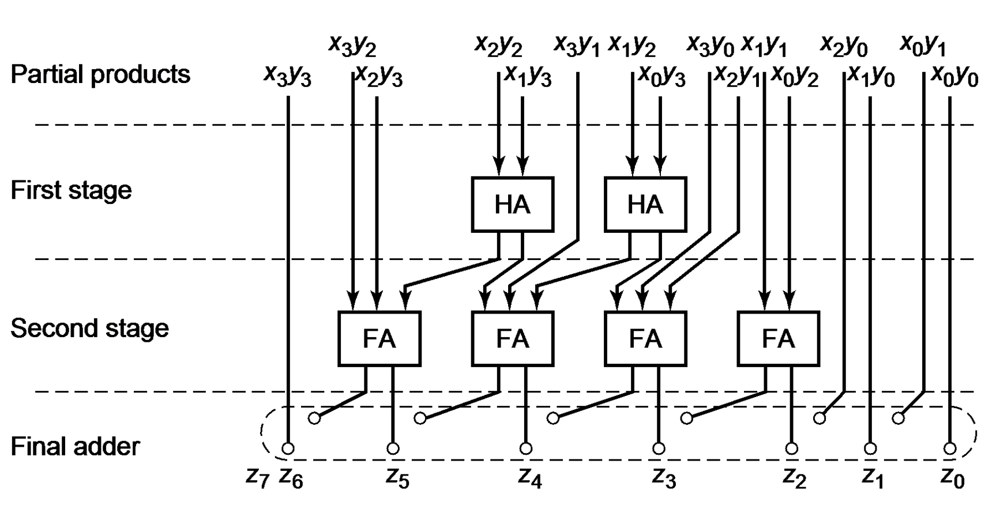

在这一章节以及下一章节当中，将会结合一些具体的应用实例来说明组合逻辑电路以及时序逻辑电路的设计，并介绍一些PyHCL的高阶使用方法。在这一章节以及下一章节当中，所有的实例都不会给出具体的硬件代码实现，而是仅讲述其原理以及结构，最终的代码实现以及仿真均由读者完成。

# 阵列乘法器

在处理器当中，实现乘法的方式有很多种。如果指令集自身不具有乘法指令，且硬件自身没有乘法器，那么可以通过加法指令以及移位寄存器来实现类似于手算二进制乘法原理的乘法指令。但是这种方法的效率非常低下，因此考虑使用硬件来实现一个乘法运算单元。下面介绍一种简单的4x4阵列乘法器的结构。

首先考虑手工计算二进制数乘法的步骤，下面给出一个例子：


可以发现，计算过程中，首先让被乘数与乘数各个位进行按位与操作，得到部分积。部分积之间再做加法操作得到乘法的结果。实际上，计算的过程可以使用一定的与门以及加法器实现：


4位二进制数乘法得到的结果最大可以有8位。请根据上述的硬件电路结构图，使用PyHCL实现上述的简单4x4的阵列乘法器，并进行仿真验证操作。

## 华莱士乘法器

上述的阵列乘法器虽然直观简单，但是其有一个明显的缺点，就是当乘法数位数增长后，进位链会变得非常长，从而导致延时较大，效率降低。而华莱士乘法器通过逐层减少各权重的与结果来降低传统阵列乘法器的进位延时。下面来看一个具体的运算例子。

考虑两个二进制数的相乘：1011 \* 1101（11 \* 13）。其运算步骤如下：

```
        1 0 1 1
      x 1 1 0 1
----------------
        1 0 1 1
      0 0 0 0
    1 0 1 1
  1 0 1 1
----------------
1 0 0 0 1 1 1 1
```

下面对部分积进行变形，根据部分积中每一位的权重来进行排列，如权重为1的是x0和y0的乘积，权重为2的是x1和y0以及x0和y1的乘积。权重的排列从右至左越来越大，也就是说，将权重排列如下：

| 权重64 | 权重32 | 权重16 | 权重8 | 权重4 | 权重2 | 权重1 |
| :----: | :----: | :----: | :---: | :---: | :---: | :---: |
|  x3y3  |  x3y2  |  x3y1  | x3y0  | x2y0  | x1y0  | X0y0  |
|        |  x2y3  |  x2y2  | x2y1  | x1y1  | x0y1  |       |
|        |        |  x1y3  | x1y2  | x0y2  |       |       |
|        |        |        | x0y3  |       |       |       |

因此，上述的运算步骤中的部分积排列更改为：

```
        1 0 1 1
      x 1 1 0 1
----------------
  1 1 0 1 0 1 1
    0 0 0 0 0
      1 1 1
        1
```

首先使用两个半加器计算x0y3与x1y2以及x1y3与x2y2的结果得到：

```
  1 1 0 1 0 1 1
    0 1 0 0 0
    0 1 0 1   
```

接着对权重4到权重32进行全加以及半加操作：

```
  1 1 0 1 0 1 1
  0 1 0 0 1 0   
```

输入到最后一层加法器得到：

```
1 0 0 0 1 1 1 1
```

实际上，华莱士树利用的原理是：一个全加器中的三个输入口虽然有赋予意义：两个输入数以及一个进位输入，但是实际上，交换任意两个输入得到的结果实际上是一样的。同时，三个输入得到两个输出，意味着运算数减少。回到上面的计算步骤，可以发现除了最后一步以外，部分积的结果之间不会产生进位链，因此可以有效的降低延迟，然而布线的复杂度会提高：



请根据上述的华莱士乘法器原理以及结构图，使用PyHCL实现一个4x4的华莱士乘法器，并自行仿真验证其正确性。

> 把一串全加器简单排成一行，它们之间进位线不连,，把这样一串全加器称为保留进位加法器（CSA）。CSA具有以下的特性：三个输入数等于两个输出数之和（注意进位属于下一位），因此CSA可以将3个输入数缩减为2个数。

# 实验内容和练习

这一章节当中的实验内容包括上述需要读者自行实现并验证的所有内容，并包括一些简单的不需要详细讲解的实例练习。

## 简易时钟分频

PyHCL中所有的电路的输入时钟都是同步的，但是我们可以探讨如何将该时钟分频作为输出。时钟分频指的是，如将输入时钟二分频，指的是将输入时钟周期乘以2，二分频的时钟周期是输入时钟周期的两倍：二分频和四分频的时钟如下图所示：


请使用PyHCL来实现一个时钟分频的模块，它只有两个输出，如上图，分别是二分频以及四分频的时钟信号。

HINT：使用计数器来实现，计数器溢出翻转。

## The World与Star Platinum

在JOJO的奇妙冒险第三部当中，The World（ザワールド）是著名反派DIO的替身，其具有时停的绝技。而主角承太郎的替身Star Platinum（スタープラチナ）与The World实际上是同类型的替身。在最后的决战当中，承太郎现场领悟时停的真谛，并在DIO时停的时间阈值（9s）后启动时停，以此最终打败了DIO。下面假设有两个输出`DIO_Stop`以及`Jotaro_Stop`，表示DIO以及承太郎时停是否发动。假设在第九个时钟周期，DIO时停停止后承太郎马上发动了Star Platnum的时停，实现这个模块来模拟最终决战的时停场景。

> 这种实现实在是太简单了，你肯定会使用计时器来记录DIO的时停时间，但是DIO可是不会让你进入他时停的The World的，承太郎需要判断时停是否停止才会触发Star Platinum的时停，因此在`Jotaro_Stop`的输出端口实现当中不可以使用任何的计时器信息。

其实现的效果如下：


实际上，这个实验是为了练习如何判断一个信号的下降沿以及上升沿，要时刻记住上一章节时序逻辑电路当中所提到的寄存器的性质。


