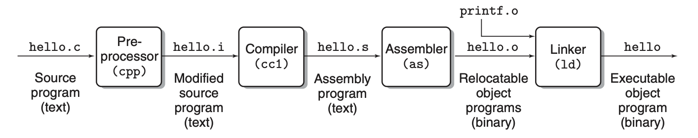
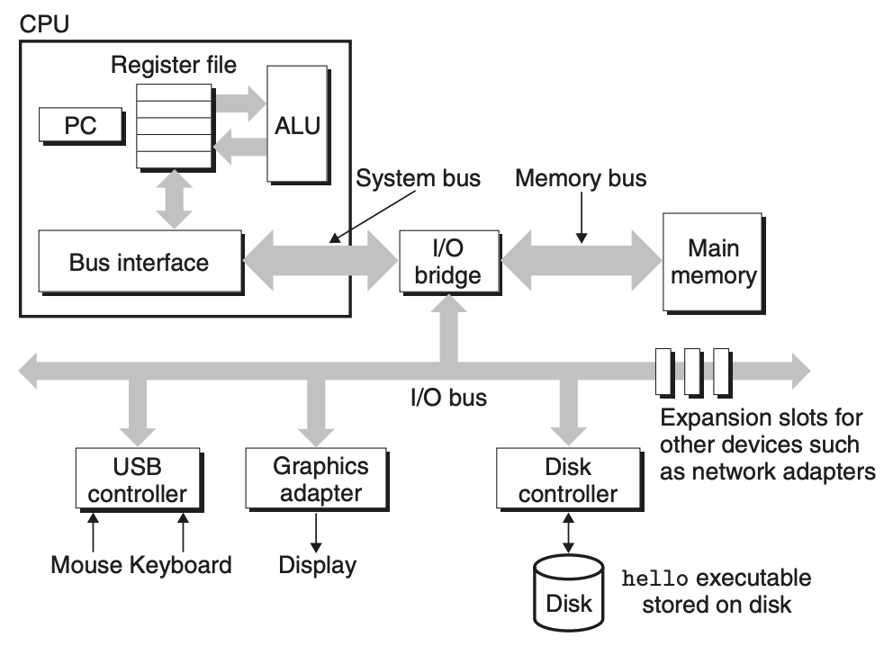

本章主要介绍关于处理器设计方面的基础内容，目的是为读者普及处理器结构、指令集架构等方面的基础知识。本章内容较多，划分为以下几个部分来进行说明：概览、指令集架构、微处理器架构、以及设计处理器所涉及到的相关理论基础以及技巧。

# 概览

## 从Hello World出发

每个程序员都会记得他自己写下的第一个程序，无论你是用什么语言，相信绝大部分的计算机专业学生都写下过这个最简单Hello World程序：

```c++
// C++的hello world程序，源代码文件名为hello_world.cpp
int main()
{
  printf("Hello World\n");
}
```

接下来，要运行这个程序，首先需要将其编译为可执行二进制文件。将编译的过程具体化就是，首先，g++的预处理器根据包含的系统头文件（即#include的内容）将相应头文件的代码直接插入到源代码文件当中（得到hello_world.i）。接着，g++的编译器会将文本文件hello_world.i编译为文本文件hello_world.s，它当中包含的是源程序的汇编语言代码，如下图所示：

```assembly
pushq   %rbp
movq    %rsp, %rbp
subq    $16, %rsp
leaq    L_.str(%rip), %rdi
movb    $0, %al
callq   _printf
xorl    %ecx, %ecx
movl    %eax, -4(%rbp)
movl    %ecx, %eax
addq    $16, %rsp
popq    %rbp
retq
```

绝大多数的读者使用的都是基于x86架构的处理器，因此编译得到的汇编语言代码就是x86汇编代码。接下来，汇编器把汇编语言代码再翻译成机器语言指令并将结果保存在目标程序hello_world.o（也称为可重定位目标程序）当中。这是一个二进制文件，其包含的数据就是机器指令的指令编码。最后，g++的链接器将标准库当中的printf函数单独的预编译文件printf.o与hello_world.o合并（注意到上面的汇编程序当中调用了`_printf`），得到一个可执行的目标文件，这个文件可以加载到内存当中供系统执行。整个流程可以用下面这个流程图演示：



绝大多数时候，我们不需要了解程序到底编译成了什么样的汇编程序，只需要将其编译成可执行文件即可。在shell当中直接执行`g++ hello_world.cpp -o hello_world`就可以得到可执行文件`hello_world`。此时，可执行文件被写入到了磁盘当中（其当中包含的执行hello world程序的机器指令也写入到了磁盘当中）。

接下来，你要运行这个这个程序。你在shell当中开始输入命令，shell本身也是一个程序，你在使用它的时候，执行这个程序的进程已经进驻于内存当中执行。你在键盘中输入下面的命令：

```shell
./hello_world
```

键盘是一种外设，其通过特定的方式来与处理器进行交互。最常见的方法是通过中断机制，简单来说，就是在你每次敲下键盘中的一个键时，都会触发一次外部中断，而处理器则会响应这次中断（具体方式要更为复杂，还会涉及到中断的优先级、中断仲裁等等），并放下现在正在执行的程序来处理这次发生的外部中断。处理中断的程序称为中断服务程序，而针对键盘中断的程序，其处理方式可以是，把键盘对应敲下的字符值，从键盘硬件的缓冲区拷贝到处理器的某个寄存器当中。接着，shell程序会将这些字符拷贝到内存特定区域当中存放。当敲下回车键后，shell就判定这次的命令输入完成，并根据读取到的指令内容执行响应的动作（这里是执行存放在磁盘当中的hello_world程序），从磁盘当中将程序代码以及数据装载进入内存当中，并开始执行。内存中的机器代码会被处理器读取并执行，概括来说，它会把"hello world.\n"从内存中复制到寄存器当中，再从寄存器当中复制到显示设备的缓冲区当中，并显示在屏幕上。一个经典的计算机组成结构如下图所示，当然这是一个非常简单的版本，现在的计算机系统远比这要复杂的多。



## 抽象层次

很多时候，计算机科学与技术的革新从某种角度上来说是往抽象层次更高的方面进步。最古老的电子计算机几乎把所有的硬件暴露给用户，而用户则需要直接操纵低级的硬件接口来使用计算机，如直接使用打孔带或者打孔卡将机器指令直接写在表格纸上来操纵计算机进行运算。随着组成计算机硬件性能的提高，计算机系统开始出现抽象的层次划分。

### 指令集架构与微处理器架构

1964年IBM发布了其System/360计算机族，并发布了IBM 360指令集架构（同时提出了指令集架构的概念）。它旨在使得System/360计算机族当中的每一种不同的计算机都可以执行同一种机器指令。换句话来说，指令集架构就是对微处理器架构的第一层抽象。微处理器架构就是最底层的硬件结构，包含处理器内部的构成以及这些构成起来的部分如何运行指令集架构。另一方面，指令集架构可以运行在不同的微处理器架构上。举个例子，你现在用的个人PC，处理器可能是Intel的也有可能是AMD的，这些处理器执行的指令集都是x86，但是它们的微处理器架构并不相同。

### 操作系统

现在，处理器的设计者可以根据所要在处理器上执行的指令集的标准，设计相应的微处理器架构。而用户则可以不需要了解最底层硬件的结构，而只需要了解该处理器执行的指令集即可。随着硬件性能提高，计算机可以执行的程序越来越多越来越丰富，为了更方便的操纵计算机硬件，并组织运行在计算机上的各种程序，操作系统应运而生。现代操作系统的功能非常多，但它的最重要的功能还是作为计算机软硬件的接口。

## 再回到Hello World

从程序到执行的路径中间实际上经历了多个不同抽象层次的处理。源程序的编译需要的g++是程序、shell也是程序，它们在你所使用的操作系统当中组织为进程，并对它们进行管理调度。生成的可执行文件写入到磁盘当中，需要操作系统对文件系统的管理组织。从磁盘写入到内存中，以及内存管理都是操作系统的工作。在讨论整个计算机系统的过程当中，实际上，操作系统与计算机组成、计算机体系结构都是密不可分的，因此，在介绍处理器怎么设计怎么执行之前，需要有一个计算机系统的总体印象。而计算机组成与体系结构的主要研究部分，就是指令集架构与微处理器架构之间的交互。

#指令集架构


