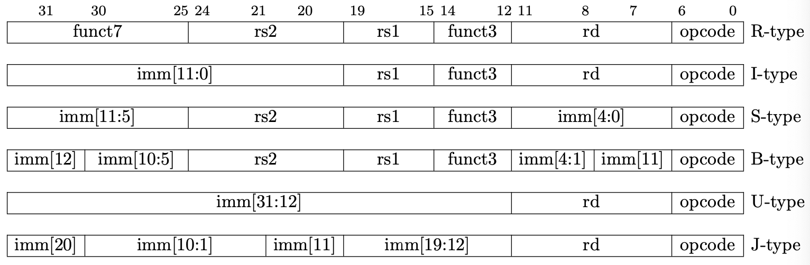

本章主要介绍关于处理器设计方面的基础内容，目的是为读者普及处理器结构、指令集架构等方面的基础知识。本章内容较多，划分为以下几个部分来进行说明：概览、指令集架构、微处理器架构、以及设计处理器所涉及到的相关理论基础以及技巧。本章主要讲述上半部分的内容。

# 概览

## 从Hello World出发

每个程序员都会记得他自己写下的第一个程序，无论你是用什么语言，相信绝大部分的计算机专业学生都写下过这个最简单Hello World程序：

```c++
// C++的hello world程序，源代码文件名为hello_world.cpp
int main()
{
  printf("Hello World\n");
}
```

接下来，要运行这个程序，首先需要将其编译为可执行二进制文件。将编译的过程具体化就是，首先，g++的预处理器根据包含的系统头文件（即#include的内容）将相应头文件的代码直接插入到源代码文件当中（得到hello_world.i）。接着，g++的编译器会将文本文件hello_world.i编译为文本文件hello_world.s，它当中包含的是源程序的汇编语言代码，如下图所示：

```assembly
pushq   %rbp
movq    %rsp, %rbp
subq    $16, %rsp
leaq    L_.str(%rip), %rdi
movb    $0, %al
callq   _printf
xorl    %ecx, %ecx
movl    %eax, -4(%rbp)
movl    %ecx, %eax
addq    $16, %rsp
popq    %rbp
retq
```

绝大多数的读者使用的都是基于x86架构的处理器，因此编译得到的汇编语言代码就是x86汇编代码。接下来，汇编器把汇编语言代码再翻译成机器语言指令并将结果保存在目标程序hello_world.o（也称为可重定位目标程序）当中。这是一个二进制文件，其包含的数据就是机器指令的指令编码。最后，g++的链接器将标准库当中的printf函数单独的预编译文件printf.o与hello_world.o合并（注意到上面的汇编程序当中调用了`_printf`），得到一个可执行的目标文件，这个文件可以加载到内存当中供系统执行。整个流程可以用下面这个流程图演示：


绝大多数时候，我们不需要了解程序到底编译成了什么样的汇编程序，只需要将其编译成可执行文件即可。在shell当中直接执行`g++ hello_world.cpp -o hello_world`就可以得到可执行文件`hello_world`。此时，可执行文件被写入到了磁盘当中（其当中包含的执行hello world程序的机器指令也写入到了磁盘当中）。

接下来，你要运行这个这个程序。你在shell当中开始输入命令，shell本身也是一个程序，你在使用它的时候，执行这个程序的进程已经进驻于内存当中执行。你在键盘中输入下面的命令：

```shell
./hello_world
```

键盘是一种外设，其通过特定的方式来与处理器进行交互。最常见的方法是通过中断机制，简单来说，就是在你每次敲下键盘中的一个键时，都会触发一次外部中断，而处理器则会响应这次中断（具体方式要更为复杂，还会涉及到中断的优先级、中断仲裁等等），并放下现在正在执行的程序来处理这次发生的外部中断。处理中断的程序称为中断服务程序，而针对键盘中断的程序，其处理方式可以是，把键盘对应敲下的字符值，从键盘硬件的缓冲区拷贝到处理器的某个寄存器当中。接着，shell程序会将这些字符拷贝到内存特定区域当中存放。当敲下回车键后，shell就判定这次的命令输入完成，并根据读取到的指令内容执行响应的动作（这里是执行存放在磁盘当中的hello_world程序），从磁盘当中将程序代码以及数据装载进入内存当中，并开始执行。内存中的机器代码会被处理器读取并执行，概括来说，它会把"hello world.\n"从内存中复制到寄存器当中，再从寄存器当中复制到显示设备的缓冲区当中，并显示在屏幕上。一个经典的计算机组成结构如下图所示，当然这是一个非常简单的版本，现在的计算机系统远比这要复杂的多。


## 抽象层次

很多时候，计算机科学与技术的革新从某种角度上来说是往抽象层次更高的方面进步。最古老的电子计算机几乎把所有的硬件暴露给用户，而用户则需要直接操纵低级的硬件接口来使用计算机，如直接使用打孔带或者打孔卡将机器指令直接写在表格纸上来操纵计算机进行运算。随着组成计算机硬件性能的提高，计算机系统开始出现抽象的层次划分。

### 指令集架构与微处理器架构

1964年IBM发布了其System/360计算机族，并发布了IBM 360指令集架构（同时提出了指令集架构的概念）。它旨在使得System/360计算机族当中的每一种不同的计算机都可以执行同一种机器指令。换句话来说，指令集架构就是对微处理器架构的第一层抽象。微处理器架构就是最底层的硬件结构，包含处理器内部的构成以及这些构成起来的部分如何运行指令集架构。另一方面，指令集架构可以运行在不同的微处理器架构上。举个例子，你现在用的个人PC，处理器可能是Intel的也有可能是AMD的，这些处理器执行的指令集都是x86，但是它们的微处理器架构并不相同。

### 操作系统

现在，处理器的设计者可以根据所要在处理器上执行的指令集的标准，设计相应的微处理器架构。而用户则可以不需要了解最底层硬件的结构，而只需要了解该处理器执行的指令集即可。随着硬件性能提高，计算机可以执行的程序越来越多越来越丰富，为了更方便的操纵计算机硬件，并组织运行在计算机上的各种程序，操作系统应运而生。现代操作系统的功能非常多，但它的最重要的功能还是作为计算机软硬件的接口。

## 再回到Hello World

从程序到执行的路径中间实际上经历了多个不同抽象层次的处理。源程序的编译需要的g++是程序、shell也是程序，它们在你所使用的操作系统当中组织为进程，并对它们进行管理调度。生成的可执行文件写入到磁盘当中，需要操作系统对文件系统的管理组织。从磁盘写入到内存中，以及内存管理都是操作系统的工作。在讨论整个计算机系统的过程当中，实际上，操作系统与计算机组成、计算机体系结构都是密不可分的，因此，在介绍处理器怎么设计怎么执行之前，需要有一个计算机系统的总体印象。而计算机组成与体系结构的主要研究部分，就是指令集架构与微处理器架构之间的交互。

#指令集架构

指令集架构可以理解为是计算机体系结构当中涉及到与程序设计相关的部分，它包括有基本数据类型、寄存器、寻址模式、存储体系、中断以及异常管理相关的信息。对于运行特定指令集的处理器来说，如Intel或者AMD，它们都是基于x86指令集架构的处理器，因此，所有运行在其上的程序都必须编译为x86机器代码才能执行。而为了增强机器代码的可读性，一般在提及指令集架构的指令时，都以它的汇编代码形式作为说明，但实际上，在处理器中进行识别执行的是机器代码（也就是由0、1组成的二进制数串）。

一般会将指令集架构分为两种：复杂指令集（CISC）以及精简指令集（RISC）。前者的典型代表是x86指令集，而后者的典型代表则是RISC-V、MIPS等。早期处理器所使用的指令集多为CISC，它的特点是指令数量庞大，包含很多极少使用的指令，且指令不定长。而RISC指令集的优势在于指令以及寻址模式精简，实现更容易，并行执行效率更好，而且编译效率更高。进入21世纪以来，一般可以说RISC已经全面优于CISC。现今最流行的x86架构的实现当中，实际上会将x86的CISC指令译码为多条类RISC指令来实现，可以说是CISC往RISC屈服的一个很好的例子。

下面，将会使用现今设计最为简洁，最为精妙的RISC指令集架构RISC-V来进行说明，指令集架构当中所包含的内容。

## RISC-V概述

[RISC-V](https://riscv.org/)是2010年在伯克利开始的第5代RISC指令集架构项目，其设计的领导者则仍是著名的图灵奖获得者帕特森。RISC-V的主要特色包括开源的指令集架构、分离的可选扩展。后者指ISA（Instruction Set Architecture，指令集架构）由基本指令集与多种扩展指令集组成。基本指令集指基于32位（RV32I）或64（RV64I）的整数基本指令集（位长表示地址空间长度标准），而扩展指令集则指使处理器支持整数乘除法标准扩展（M）、单（F）/双（D）精确度浮点运算标准扩展、原子指令标准扩展（A）等等的指令集。一个标准的RISC-V指令集，可以由一个基本指令集与任意数量的扩展指令集相结合而互不冲突，即使是最简单的RV32I指令集，其搭配一个标准的编译器也可以实现一个简单的通用型处理器。

下面将会以RV32I来作为例子进一步说明指令集的内容。

### 寄存器定义

指令集首先定义的是寄存器结构。机器指令最主要的交互对象就是寄存器。在RV32I当中，定义指令集架构寄存器有32个，分别为x0到x31。其中x0是"zero"寄存器，在实现中会设定其保存的值恒为常数0（用来作为目标寄存器舍弃某些结构），而x1到x31寄存器都是32位通用整型寄存器，每个的位宽为32位。同时，程序计数器（PC）在架构中作为x32寄存器看待（当然，实际上只是一个指代）。

RISC-V基于加载-存储架构（load-store），也就是说，与与内存进行交互只能透过load以及store类指令进行。其他所有指令都只能在寄存器上操作。

> 指令集架构当中所定义的寄存器实际上是体系架构寄存器，它与物理寄存器是有区别的。也就是说，实现RV32I的处理器当中，实际上不一定非要32个寄存器，可以实现为更多或者更少的物理寄存器。这种做法在乱序执行的处理器当中应用的比较多。为了简单期间，后文均默认物理寄存器与体系架构寄存器数量相同，均为32个。


### 指令格式定义

指令格式定义RV32I机器指令的不同位表示的意义。RV32I的指令格式定义如下：



`opcode`、`rd`、`rs1`、`rs2`、`imm`都是指令当中的意义实体，它们分别表示：

- `opcode`：操作码，表示指令所要执行操作，比如加法指令为`ADD`；
- `rd`：目的寄存器，表示指令结果所要存储的寄存器号；
- `rs1`，`rs2`：源寄存器1、2，表示指令运算或操作的值所来源的寄存器号；
- `imm`：立即数，表示直接写在指令当中的常数值。

`funct7`以及`funct3`则是用于区分同一类指令中的不同指令，如寄存器-立即数的整数运算指令当中区分`ADDI`、`ANDI等等。

### 指令定义

RV32I的指令可以分为以下几类，由于篇幅原因不能够将每一条指令都详细列出。具体的指令信息可以参考官方的[相关文档](https://riscv.org/specifications/isa-spec-pdf/)：

- 整数算术指令
  - 寄存器-立即数类指令：运算数来源是寄存器和立即数的指令；
  - 寄存器-寄存器类指令：运算书来源都是寄存器的指令；
  - NOP：冒泡指令，具体实现为`ADDI x0, x0, 0`；
- 控制指令
  - 无条件跳转；
  - 有条件跳转；
- 加载与存储指令
- 内存屏障指令（FENCE）
- 系统调用与断点指令（ECALL、EBREAK，debug用）

### 寻址模式

寻址模式定义指令中运算数的来源。RV32I中定义的寻址模式有下面几种：

- 寄存器寻址：运算数来源于寄存器；
- 立即数字面寻址：运算数来源于立即数；
- 绝对寻址：运算数来源于立即数指代的内存地址；
- 基址寻址：运算数来源于寄存器中的值与偏移量（一般是立即数）之和所得到的内存地址对应的内存块当中；
- PC相对寻址：条件分支指令中常用，针对的是指令寻址，跳转的地址以当前PC为基准加上偏移量得到；
- PC绝对寻址：直接设置下一条指令地址为立即数，即指令地址直接由立即数指代。

> 由于篇幅等原因，笔者无法将RV32I中的每条指令都一一列出并进行说明，这部分的内容请读者自行参考官方的说明文档中的内容（Chapter 2 RV32I Base Integer Instruction Set, Version 2.1）

# 思考

本章节没有实验内容，介绍基础知识居多。但是可以给出一些相关的思考问题给读者。

## Linux YES！

有些人喜欢以擅长使用或者喜欢叫嚷着Linux如何如何的好，而贬低喜欢使用Windows开发的程序员，抑或者换成是MacOS YES！的人也有，但是实际上这都是很无聊的行为，因为实际上不同的开发需求对应着不同的平台支持，比如游戏开发Windows绝对是首选的平台，而对于前后端开发来说Mac则是首选。但这些都不重要，思考一个问题，当你将一段一模一样的C++代码，比如上面的hello world，将它们在Windows、MacOS以及Linux下使用G++编译得到的二进制文件，为何不可能跨平台使用？即使是它们使用的处理器都是相同架构（如x86）。

## AMD YES！

凛同学是彻头彻尾的电脑白痴（准确的说是电器白痴），但她毅然决定需要好好利用现代科技的进步成果而不是祖传的宝石以及家事万能的某红色管家。于是她找上同班的卫宫同学询问该如何选择CPU，毕竟他好像什么电器都懂能修。卫宫同学给出的建议是AMD YES！并且稀里哗啦的说了一堆类似性价比高，功耗低，生产力怪兽之类的听不懂的话，让人严重怀疑他是不是把某些粗制滥造的电脑杂志上胡编乱造的鬼话扯过来。你能够给电脑白痴凛同学提一下选择CPU的建议吗？她该选择内核数更多，功耗更小的AMD处理器，还是单核性能更佳，频率更高的Intel处理器呢？如果是你，现在给你一个组装台式机的机会，你又会选择什么样的CPU以及主板作为你的主机新平台呢？说说你的理由。

> 脑洞大开，这里自由发挥即可。

## 古早程序员体验

现在来体验一下上世纪的程序员，不妨试试使用汇编语言来编程。读者不妨在阅读RV32I的官方文档后，试着用RV32I汇编代码写一段冒泡排序的代码，对一个只有5个整数的数组进行冒泡排序。然后试着与g++编译的C++代码进行对比，看看是你写的汇编代码更简单还是g++编译后的更简单。（RISC-V的g++编译器可以从[这里](https://github.com/riscv/riscv-gnu-toolchain)下载并配置）

