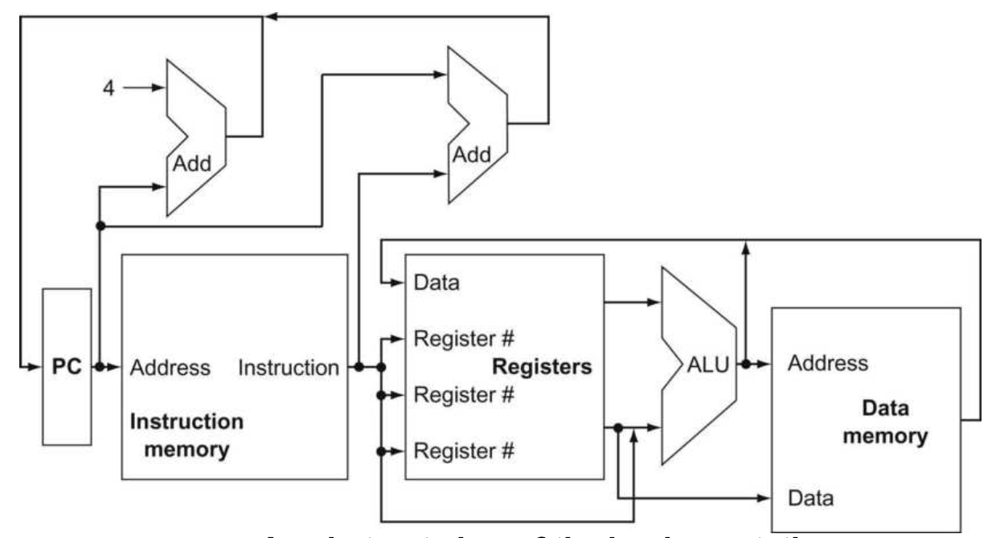
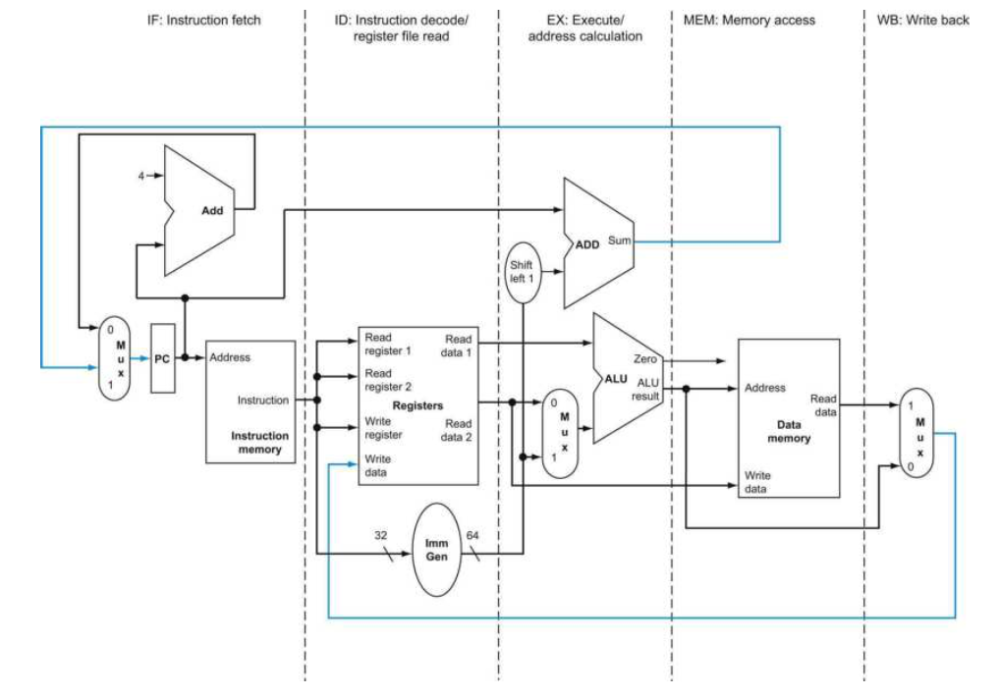
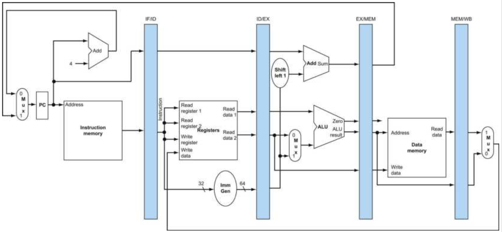
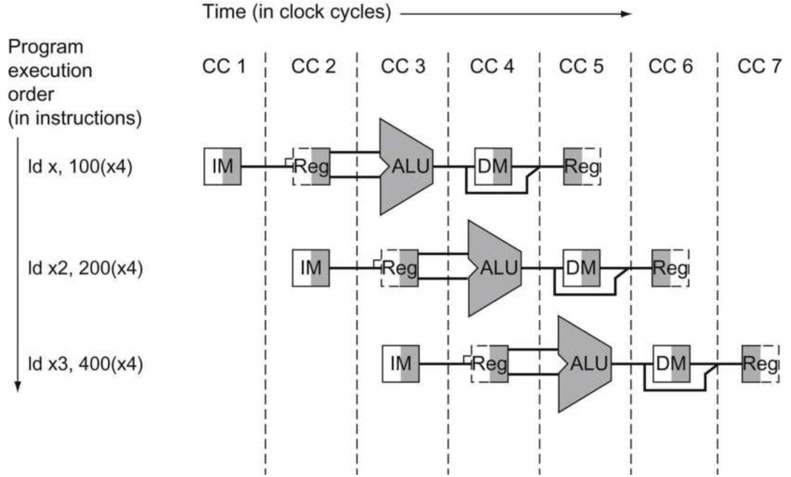
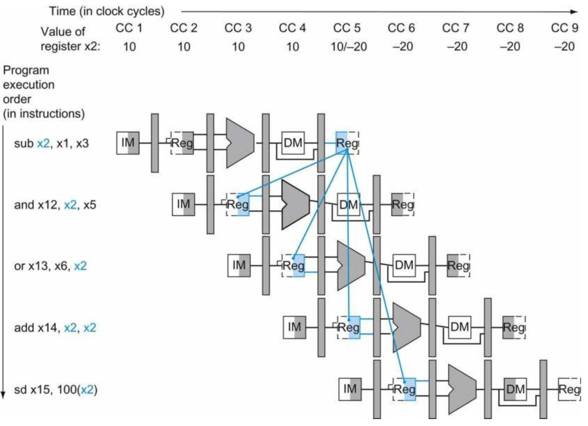
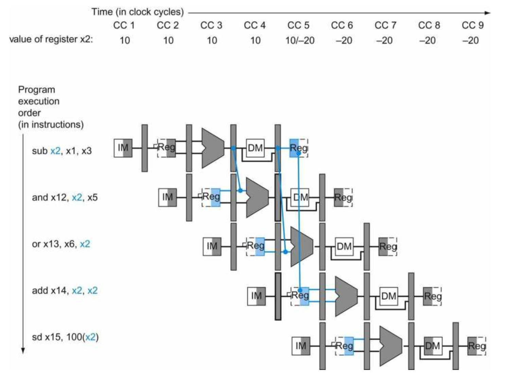

本章主要讲述处理器设计的下半部分内容，主要设计处理器设计的基本思路以及方法。

# 抽象概览

上一章曾说过，设计处理器之前需要首先决定该处理器所要实现的指令集架构，也就是说，这个处理器需要执行哪个指令集的指令。从某种角度上来说，处理器就是针对执行某个指令集而设计。在这一章当中，将会以如何实现一个执行RV32I指令集的处理器作为例子进行讲解。

一般来说，现代的处理器非常复杂。实际上，从市面上购买的商用处理器已经不单单只是处理器核，其实际上已经相当于一个片上系统（System on Chip，SoC）。举例来说，Intel的第9代i7-9700k处理器包含有：8个处理器核、L3级缓存、环形内部互联总线、集成GPU、高速PCI-E控制器、DMI控制器、存储器（内存）控制器以及其他IO控制器（如USB等）。

> 一般会将处理器的核心部分，也就是处理器核部分（如9700k中的8个核）称为core，而其他的部分称为uncore。

显然，本实验大纲中提到的处理器的设计，仅仅只包括处理器核当中的核心运算部分（并且是极度简化过的），一款真正的商用级别的处理器芯片，需要数十甚至多达数百数千位工程师努力。但是，我们依然可以掌握设计处理器核的一些最基本的原理以及方法。

## 高层次RISC-V实现的全貌

要实现一个抽象的，最简单的RV32I处理器核，可以首先考虑这些问题：为了执行RV32I的指令，需要什么功能器件？首先考虑所有指令都需要的部分，取得指令以及指令译码部分。这两个部分是所有的指令都需要实现的，很多时候，这两个步骤也称为处理器的前端设计部分，而后续运算等的部分称为后端设计部分。

> 一般会将处理器对一条指令执行的各个步骤分解为5步，分别是：
>
> - 取指（Instruction Fetch，IF）：从指令缓存中获取下一条要执行的指令；
> - 译码（Instruction Decode，ID）：对机器指令译码，判断指令所要执行的行为；
> - 执行（Execute，EX/EXE）：执行指令；
> - 访存（Memory，MEM）：访问存储器；
> - 写回（Write Back，WB）：将指令执行结果写回到目的寄存器。

取指以及译码需要一个程序计数器（PC）来存放下一条要执行指令的地址，所以还需要一个指令缓存来存放指令（在这里我们采用哈佛结构，也就是指令缓存和数据缓存是分离的）。接下来是译码，需要一个控制逻辑来译码，并根据译码结果驱动处理器的各个部件运作（一般通过信号输出来实现，这个控制逻辑一般称为主控制逻辑）。

接下来是执行。指令执行的操作数来源于寄存器，所以寄存器组是必须的，然后是执行指令需要的算术逻辑单元（ALU）。访存阶段主要是针对数据缓存的访问，因此需要一个数据缓存。最后写回阶段则是写回到寄存器组。

明晰了构成一个最简单的处理器需要哪些部件之后，我们可以构建一个整个处理器的数据路径图，表示执行每个指令时指令、数据流动的数据路径。而设计一个处理器，首先就是要设计每个指令的数据路径图，并将它们组合起来：



## 流水线

如果简单的将整个处理器所需要的逻辑部件以及数据通路设计出来，那么实际上这个处理器已经可以正常运行了。这样的处理器能够正确的执行指令，但是它的效率非常低下，因为此时需要取执行时间最长的指令作为该处理器的一个时钟周期。因此，可以引入流水线来提高处理器执行的效率。

上面提到了，一个处理器执行可以经典的划为5个步骤。因此，可以将每个步骤作为流水线中的一级，因此，一个经典的五级流水线处理器可以如下进行划分：



将处理器流水线化，需要在每一个级之间添加一个寄存器（称为流水线阶段寄存器），来存放处理器在执行了上一级后产生的数据以及信号，因此，流水线化的数据同路会变为：



结合寄存器的性质，很容易就可以得到流水线执行的模型：寄存器在每个时钟周期的上升沿会将输入数据写入，因此每个时钟周期会执行两个流水线阶段寄存器之间的组合逻辑。举例来说，假设有两条指令，分别是ADD以及后面的LD指令。在第i个时钟周期，ADD指令执行到了EX阶段，而LD指令执行到了ID阶段，此时ID/EX寄存器当中保存的是ADD指令在EX阶段执行所需要的数据和信号，而IF/ID寄存器当中保存的是LD指令在ED阶段执行所需要的数据和信号。此时，在第i+1个时钟周期的上升沿到来前的一个瞬间，ADD指令在EX阶段以及LD在ID阶段执行所产生的结果已经分别驱动在了EX/MEM寄存器的输入口以及ID/EX寄存器的输入口当中。当下一个时钟周期的上升沿到来时，便会进行写入操作，因此在第i+1个时钟周期，ADD指令进行MEM阶段的操作，而LD指令则进行EX阶段的操作。这种流水线的执行操作可以用下面一幅图来形象的展示：



# 冒险处理

在流水线处理器当中，由于指令执行的并行性，执行过程中可能会产生逻辑上不正确的结果，称为冒险（Hazard）。冒险主要分为3种类型：结构冒险（Structural Hazards）、数据冒险（Data Hazards）以及控制冒险（Control Hazards）。首先，所有的冒险实际上都可以通过在可能会产生冒险的指令之间插入冒泡指令（NOP，或者称为空指令），但是这样的做法会导致流水线的效率低下，因此需要在硬件层次上来解决这些问题要远比仅仅在编译器上做简单的手脚要更好。

## 结构冒险

结构冒险是指，在同一个时钟周期中，处于流水线上的两个或更多不同指令需要同一个功能部件的情况。比如，在同一个时钟周期内，不同的指令需要读写同一个寄存器、不同指令读写存储器（单端口的RAM就会出现这种情况）。结构冒险的解决方法比较简单，可以将产生冒险的功能器件分离为两个功能不相交的部件解决，或者使用时序写入组合逻辑读的方式来实现（一般用在寄存器），抑或者是增加存储器的输入输出端口。实际上，结构冒险基本上在设计过程中就可以避免。

## 数据冒险

数据冒险来源于数据依赖性。在顺序流水线处理器当中（我们简单的处理器采用顺序执行，乱序执行的处理器要更为复杂，但是现代处理器基本都是采用乱序执行的），只存在一种依赖，也就是写后读（RAW）依赖。举例来说，假设有如下的指令要执行：

```assembly
sub x2, x1, x3      // x2被写入
and x12, x2, x5     // 第一个操作数（x2）依赖于sub
or x13, x6, x2      // 第二个操作数（x2）依赖于sub
add x14, x2, x2     // 第一（x2）和第二（x2）个操作数依赖于sub
sd x15, 100(x2)     // 基址寄存器（x2）依赖于sub
```

可以通过一个时间轴来更具体的描述依赖情况：



对于SUB指令来说，x2的结果要到第5个时钟周期才能写入。那么在第五个时钟周期前，x2的值都是不可用的。但是对于AND和OR指令来说，它们在第5个时钟周期前就已经需要用到x2的值了，这时候就会发生冒险。如果不做处理，这两个指令都会读取到错误的值（10）。

实际上，当我们仔细观察上图，可以发现一个事实：写入到x2的值实际上在第三个周期就已经在EX阶段计算出来了。也就是说，在第3到第5个时钟周期之间，x2要回写的值已经保存在了流水线阶段寄存器当中。那么其实我们可以通过一种旁路的手段来解决，也就是说，通过判断指令之间出现的冒险情况，决定运算数的来源于寄存器，抑或是某个流水线阶段寄存器当中：



而对于ADD指令来说，可以通过将寄存器组实现为时序逻辑写，组合逻辑读避免冒险（也就是当读写同一个寄存器时可以实现为直通）。

## 控制冒险

控制冒险来源于条件跳转指令的不可确定性。条件跳转指令需要在EX阶段对跳转条件进行比较后才能决定是否执行跳转的操作，在流水线当中，条件跳转指令在执行到EX阶段前，流水线的状态是不稳定的。如果不做任何操作，当条件跳转不执行时，流水线没有损失。但是当跳转需要执行的时候，则需要冲刷流水线，重新载入正确的指令执行，此时流水线的像驴就会发生降低。

为了避免控制冒险，最简单的处理方式就是冒泡等待，但是这种方法效率很低，不建议使用。分支预测是用于解决控制冒险的一种手段，它通过在取指到条件分支指令时进行预测其是否执行来提高流水线的效率。在这里由于篇幅问题就不做进一步的展开，因为此方面的知识非常多，感兴趣的读者可以进一步阅读相关资料：

> Computer Organization and Design RISC-V edition: Chapter 4, 4.8 Control Hazards.


由于关于处理器设计的内容实在是非常多，读者由于篇幅与时间等原因不可能面面俱到，只能够浅尝即止的给读者科普性的进行讲解。因此，感兴趣的读者可以参考Chapter 0当中提及的参考书目进行阅读。

# 思考

本章节的思考题读者都可以自由发挥。

## 认识你的电脑

你使用了这么久的爱机，但是你知道它的配置究竟如何吗？请给出你现在所使用的计算机的处理器型号，并查阅相关资料，给出它的详细信息，包括内核数、线程数、基本频率、最高频率、功耗、缓存、支持的指令集等信息。并给出你所使用的计算机的详细配置，包括内存大小、内存类型、内存频率、硬盘类型、硬盘大小、显卡等等的信息。

## 数据冒险的判断

思考如何实现一个旁路，也就是解决数据冒险的方法。包括如何判断发生数据冒险、如何旁路的具体方式。

